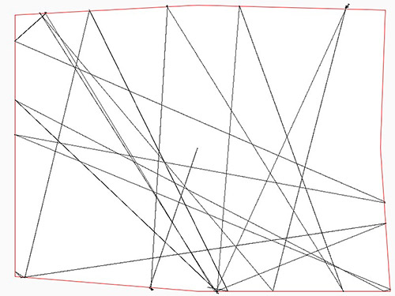

######Hannas Readme.md  

# Generative Gestaltung
### Dokumentation Pettern Procedure

[HannaHoffmann](https://github.com/HannaHoffmann).

##### **Analoge Anweisung**

**Hier die Anweisung,also der "Genetischer Code", für ein zweidimensionales Muster: **

1. Setze auf dem Blatt (DIN A 4) 7 verschiedene Punkte, die möglichst weit voneinander entfernt liegen.

2. Verbinde die Punkte so, das eine ganze Fläche entsteht

3. Setze deinen Stift nun in die Mitte der Fläche auf und male eine Gerade in eine beliebige Richtung

4. Sobald die Gerade die Kontur der Fläche erreicht, lass die Gerade in einem beliebigen Winkel abknicken. Die Gerade darf dabei die Fläche nicht verlassen.

5. Wenn die Gerade auf sich selbst trifft, lasse sie abermals abknicken in einem Winkel, der über 90Grad liegt.

6. Führe die "endlose" Gerade so lange weiter, bis die Fläche -deiner Meinung nach- voll ist.

*Hier drei Beispiele der entstandenen Bildern:*

#####**Processing Code**

**Der "Genetische Code" sollte nun in einen Processing Code umgesetzt werden:**

	
	float x; 
	float y; 

	float richtungx;
	float richtungy;

	void setup() {
	
	 background(250);

	
	size(800, 600);
		 
	  x=width/2;
	  y=height/2;
	  richtung();
	  
	  smooth(8);
  
    fill(255);

    stroke(255, 0, 0);
    
    beginShape();
    vertex(30, 30);
    vertex(400, 10);
    vertex(780, 20);
    vertex(770, 300);
    vertex(790, 590);
    vertex(400, 590);
    vertex(30, 560);
    endShape(CLOSE);
    
    stroke(0);
    }

	void draw() {

	loadPixels();
	int pixel = get((int)x, (int)y);
	if (pixel == (-65536) || pixel == (-328966) ) { 
	}
	
	point(x, y);
	
	x = x+richtungx;
	y = y+richtungy;
	}
	
	void richtung() {
	richtungx = random(-1, 1); //Richtung wird zufällig bestimmt zwischen -1 und +1
	richtungy = random(-1, 1);
	}
	
	String timestamp;
	void keyPressed() {
	if(key == 's') {
	timestamp = year() + nf(month(),2) + nf(day(),2) + "-" + nf(hour(),2) + nf(minute(),2) + nf(second(),2);
	saveFrame("lines-"+timestamp+".jpg");
	}
		}

Leider ist es mir nicht gelungen, die Gerade abknicken zu lassen, wenn sie auf sich selbst trifft.

*Hier drei Sketche, die aus dem Code enstanden sind:*

  

##### **Anwendung des Musters**

