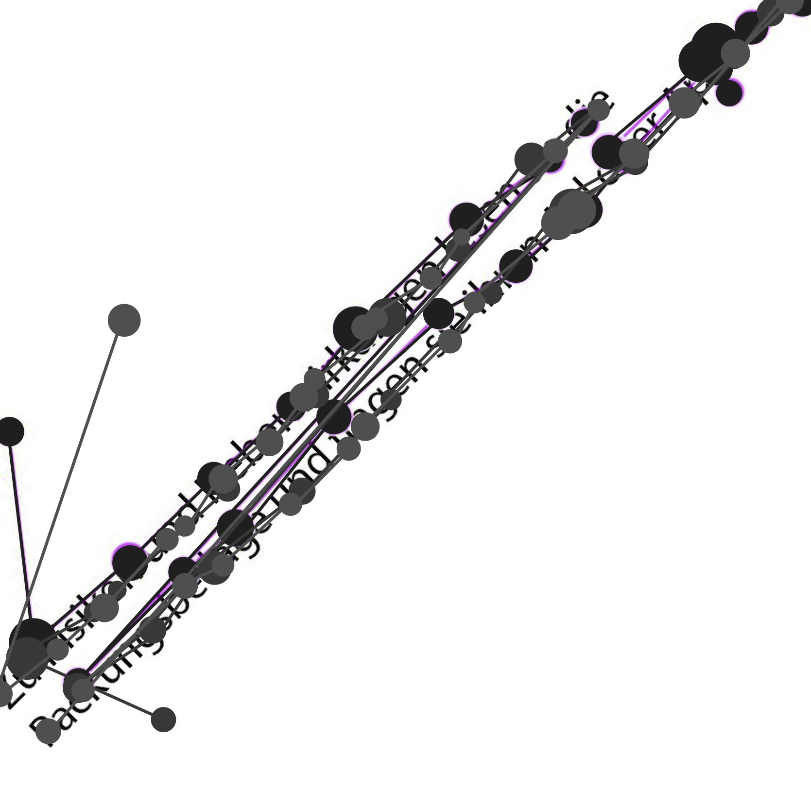
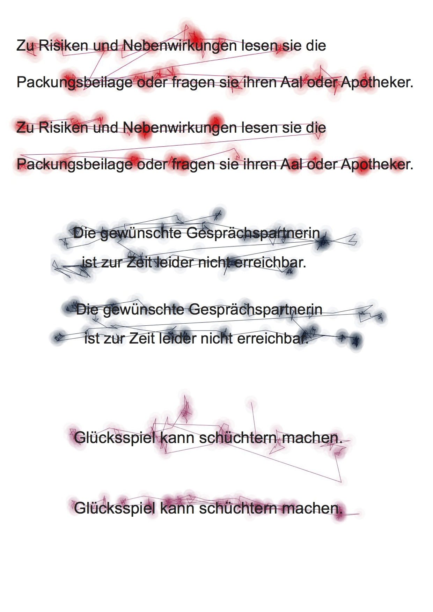
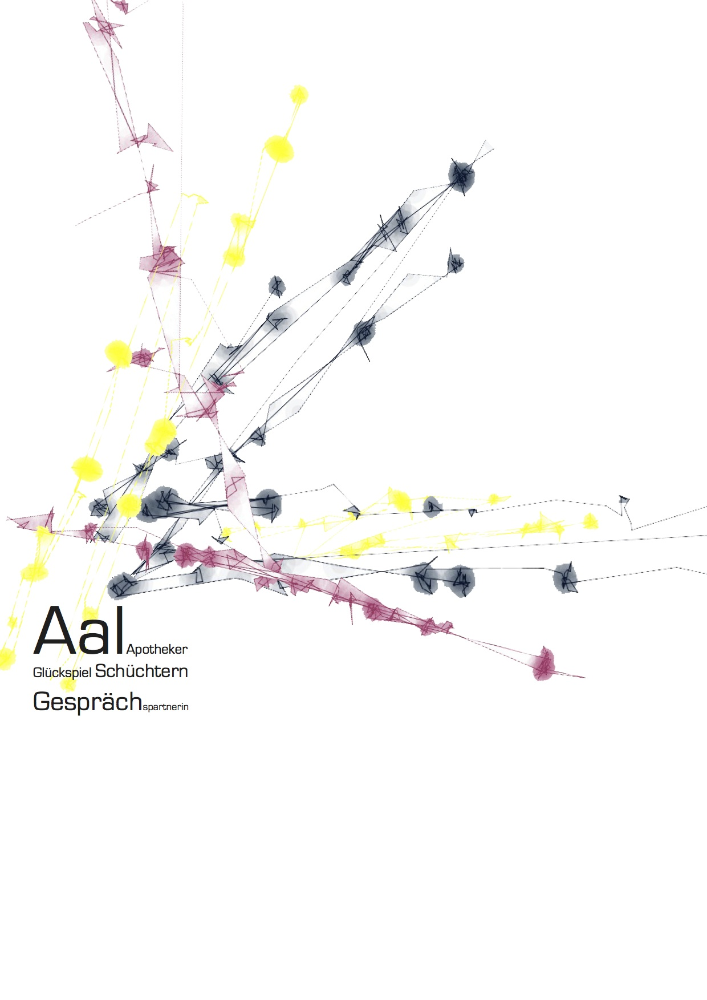

######Hannas Readme - Eye Tracking.md  

# Generative Gestaltung
### Dokumentation "Eye Tracking"

[HannaHoffmann](https://github.com/HannaHoffmann)

Im Bereich Eye-Tracking war das Ziel eine klassisch gestalterische Bild-Text Kombination in Form eines Plakats zu erstellen.
Eye-Tracking ist ein Verfahren, bei dem die Blickbewegung einer Person erfasst werden kann, zum Beispiel, wie in unserem Fall, beim Lesen eines bestimmten Textes.

Der Text für das Projekt war frei wählbar. Dazu sollte eine Leseanweisung für das Labor geschrieben werden.

Bei meiner Auswahl suchte ich nach bekannten Sätzen, die den Menschen in ihrem Alltag immer wieder begegnen. Der Satz sollte dann an einer Stelle verändert werden. Bei meinem ersten Versuch arbeitete ich mit dem Satz: "Zu Risiken und Nebenwirkungen lesen sie die Packungsbeilage und fragen sie ihren Aal oder Apotheker".

Die Probanden sollten den Text im Labor laut vorlesen, um zu bewirken, dass sie den "Fehler" im Satz nicht überlesen.

In der späteren Arbeit, fügte ich noch die Sätze: "Glückspiel kann schüchtern machen" und "Die gewünschte Gesprächspartnerin ist zur Zeit leider nicht erreichbar" hinzu.

Um die Daten in Bilder zu übersetzen musste ein Code geschrieben werden:

	Table table;
	int w, h;
	ArrayList <PVector> points;
	
	void setup() 
	{
	
	background(255);
	
	table = loadTable("Rec 01-All-Data_.tsv", "header, tsv");
	size(1280,1024);
	points = getPoints(table);
	
	noFill();
	beginShape();
	
	for (int i = 0 ; i < points.size();i++) {
    PVector p = points.get(i);
    vertex(p.x, p.y);
    }
    
    endShape();
    fill(255,0,0);
    for (int i = 0 ; i < points.size();i++) {
    PVector p = points.get(i);
    ellipse(p.x, p.y,10,10);
    	}
    }
    
    ArrayList <PVector> getPoints (Table t) {
    ArrayList<PVector>temp = new ArrayList<PVector>();
    
	for (TableRow row : t.rows()) {
	float x = row.getFloat("GazePointX"); 
	float y = row.getFloat("GazePointY");
	temp.add(new PVector(x, y));
	
	  }
	return temp;
	}

	void keyPressed(){
	if(key == 's'){
	saveFrame("my-image-####.jpg");
		}
	}
	

Aus den Linien, Verdichtungen und typografischen Elementen ist ein Plakat entstanden.

####Fazit
Die Projektidee, aus den Lesebewegungen von Probanden eine visuelle Darstellung für ein Plakat zu erstellen, hat mir sehr gefallen. Die Umsetzung im Labor hingegen war zu Anfang eher mühsam, da das Programm oft abgestürzt ist und wir die Aufnahmen nicht speichern konnten. Meine Idee, die Probanden über die Sätze "stolpern" zu lassen ist, den Bildern nach zu urteilen, nicht ganz aufgegangen. Trotzdem war es spannend, sich mit dem Prozess des "Eyetrackens" auseinanderzusetzen.

