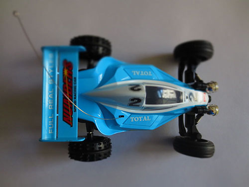
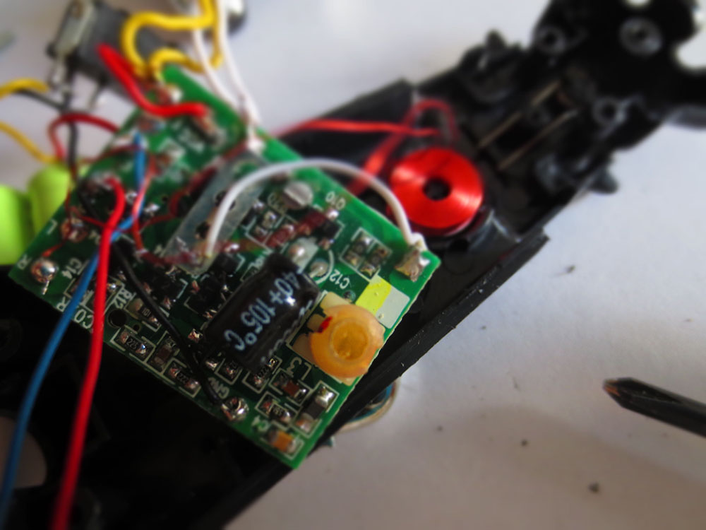
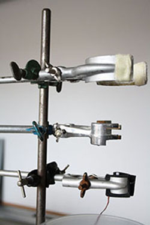
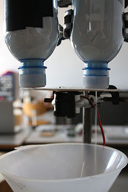
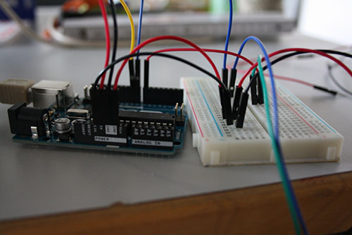
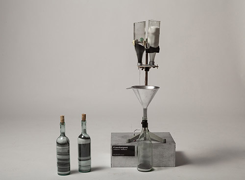
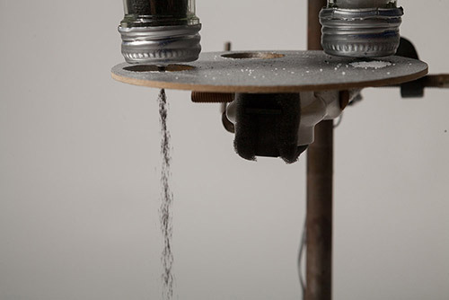
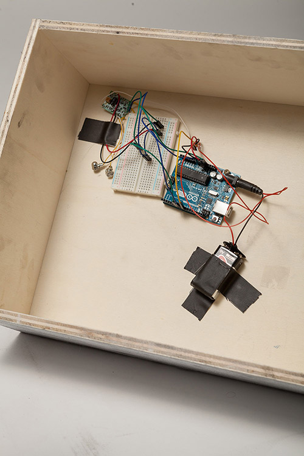

######Hannas Readme.md  

# Input / Output
### Dokumentation RCC Hack

[HannaHoffmann](https://github.com/HannaHoffmann).

##### **Physikalische und/oder mechatronische Informationsvisualisierung der FHP Website**

Die Aufgabe unseres letzten Projektes war es, die Besucheranzahl der neuen FHP Website zu visualisieren. Als Ausgangsmaterial bekamen wir ein ferngesteuertes Auto.

Der Input für das Objekt waren drei Dinge:

1. Die Besucheranzahl steigt = Vorwärts
2. Die Besucheranzahl sinkt = Rückwärts
3. Die Besucheranzahl bleibt gleich = Stehend

######Konzept
Meine Idee war es, verschieden farbigen Sand aus zwei Glasflaschen in einen Trichter laufen zu lassen, um die Entwicklung der Besucherzahlen zu visualisieren. Die an einem Holzgestell befestigten Glasflaschen, sollten durch einen mechatronischen Schließmechanismus mit der Entwicklung der Besucherzahlen korresponiderend geschlossen und geöffnet werden. So sollten verschieden farbige Sandschichten in einer Glasflasche entstehen, andenen man nachher den Traffic der Website von ca. einer Stunde ablesen könnte. 

Zunächst beschäftigte ich mich mit dem Schließmechanismus für die beiden oberen Flaschen. Wie übersetzt man die Drehbewegung des Motors in eine Linearbewegung, um ein Schiebeelement unter den Flaschen zu bewegen?

Bei der Vorstellung meines Konzepts im Kurs kamen zwei Ideen auf: Der Motor könnte durch mehrere Zahnräder in eine lineare Bewegung übersetzt werden oder man ersetzt das Schiebeteil durch ein rundes Element (wie bei einem Salzstreuer) und benutzt anstatt des normalen Automotors einen Servomotor.
Ich entschied mich für Letzteres.

Anschließend begann ich einen Prototyp zu bauen.
######Prototyp
Für die Glasflaschen nahm ich zuerst Plastikflaschen, einen Trichter konnte ich leicht besorgen und durch Zufall bekam ich ein Metallgestell und zugehörige Greifzangen aus einem alten Chemielabor, sodass ich das Holzgestell nicht mehr brauchte.

Als erstes entschied ich mich dafür, anstatt Sand, Salz in die Flaschen zu füllen.
Es gestaltete sich als äußerst schwierig, die Größe der Löcher in den Deckeln der Flaschen so auszutarieren, dass sie nicht zu klein werden (dann kann das Salz nicht durchfließen), aber auch nicht zu groß (der Druck wird zu groß und der Servomotor kann sich nicht mehr drehen). Anschließend musste ich lange die Drehbewegung des Servomotors ausmessen, sodass immer nur eine Flasche geöffnet und eine geschlossen wurde.

######Umsetzung
Die Umsetzung des Prototyps in die entgültigen Materialien war gar nicht mehr so schwer. Spannend war es, das Glas der kleinen Flaschen am Boden zu schneiden. In Gesprächen erfuhr ich mehrere Möglichkeiten:
1. In die leere Flasche ein 5 Cent Stück legen und so lange schütteln, bis der Boden abplatzt
2. Mit einem Glasschneider einschneiden und anschließend das Glas abklopfen
3. Einen Wollfaden in Nagellackentferner (mit Acetol) einlegen, um die Flasche wickeln, anzünden und brennend in eine kleine Schüssel mit kaltem Wasser tauchen.
Ich probierte alle drei Möglichkeiten in selbiger Reihenfolge. Die dritte Variante klappte.
Das Salz färbte ich mit Kohle schwarz, die Holzkiste und der Plastik Trichter wurden silber angesrpüht.
Die gesamte Elektronik befindet sich im Holzkasten und ist durch, ebenfalls silber angesprühte, Kabel mit dem Servomotor verbunden.

######Präsentation

#####Fazit
Der RCC Hack war mit Abstand mein Lieblingsprojekt aus dem Kurs. Halb Erfinder, halb Hacker, halb Wissenschaftler und Designer, haben wir Autos auseinandergenommen, Kabel durchgeschnitten, Codes geschrieben und uns mit den unterschiedlichen Beschaffenheiten verschiedener Materialien beschäftigt. Fabian und Monika Hoinkis waren uns dabei eine große Hilfe.
Die Präsentation unserer Ergebnisse war wahninnig spannend und hat unserer Arbeit Aufmerksamkeit geschenkt.
Ich bin sehr zufrieden mit meinem Objekt und habe es sogar, dank der Materialien, besser umsetzen können, als in meinem Konzept vorgesehen.

Der gesamte Kurs hat mir, aufgrund der vielen Neuigkeiten und auch Schwierigkeiten, sehr gute gefallen. Grade im letzten Projekt ist mir klar geworden, dass man Design mit vielen Dingen vereinen kann. Ein Interface Studium ist durch den Kurs und natürlich durch Gespräche mit Kommilitonen für mich plötzlich vorstellbar geworden. Ich werde mich in den nächsten Semestern weiter in diesem Bereich versuchen.

Ich möchte an dieser Stelle noch sagen, dass ich mich der Tod von Monika Hoinkis sehr traurig macht. Sie war eine motivierende und begeisternde Professorin, ich habe das Studium bei ihr sehr geschätzt. 