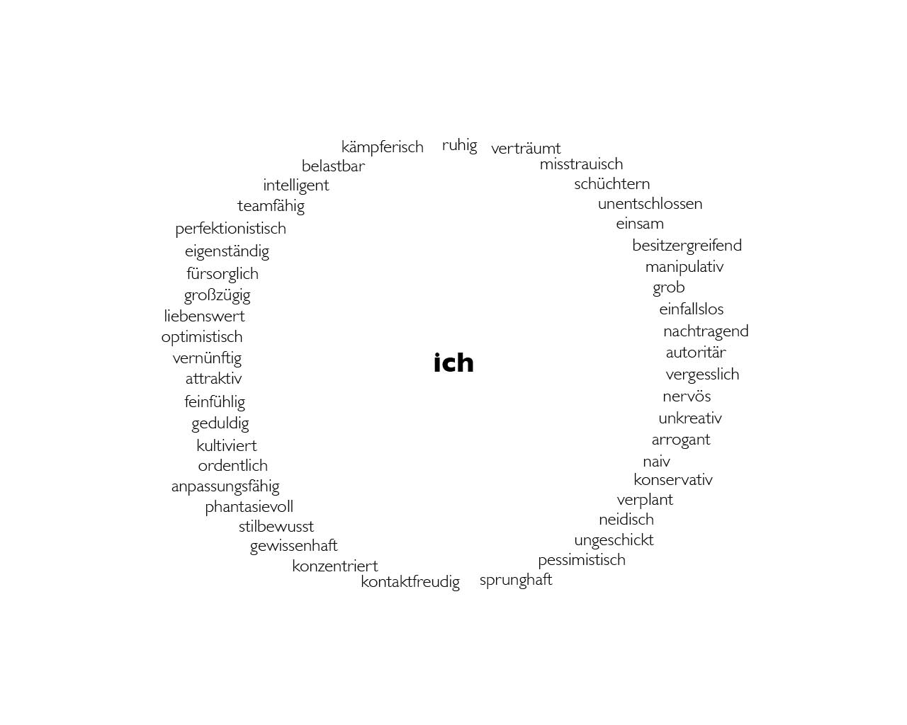
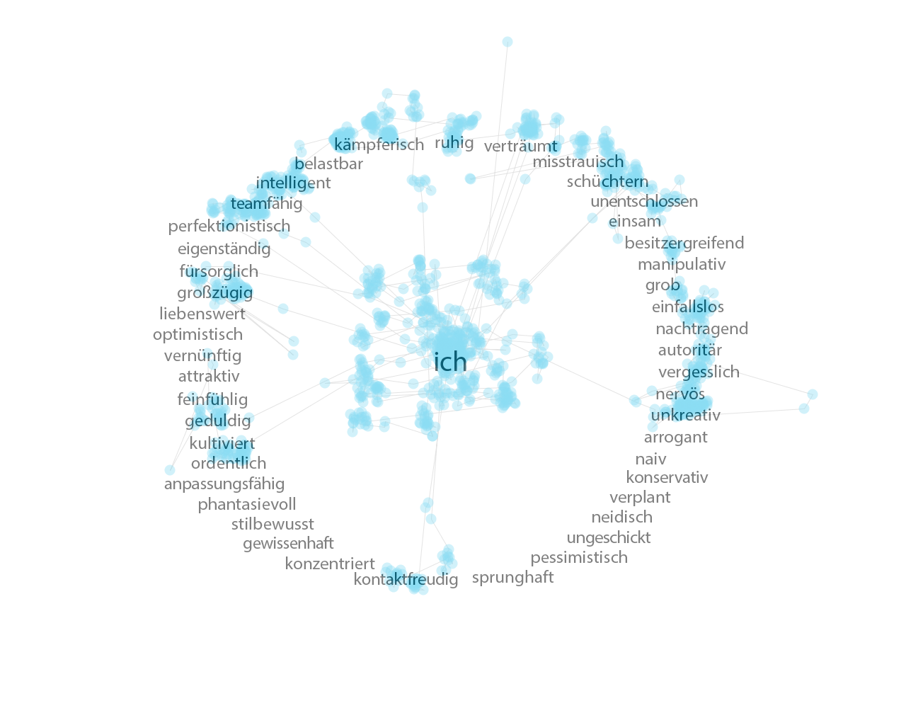
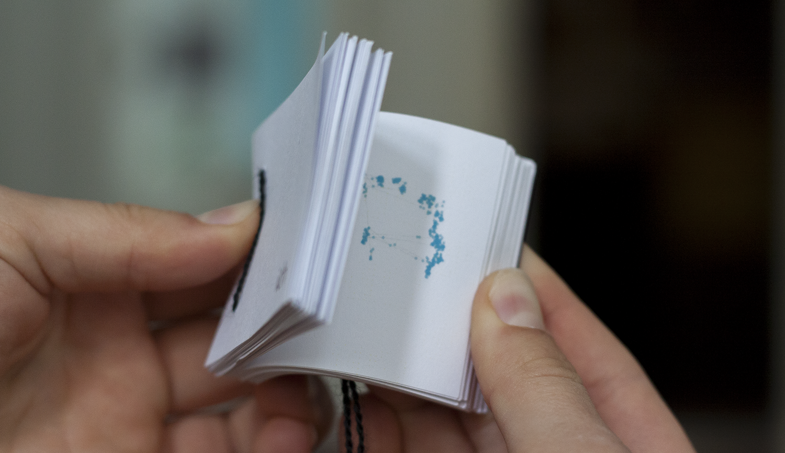

# Eyetracking: Character–Tracking
Buchstaben, Wörter und/oder Sätze sind als Eyetracking–Vorlage auf einer Fläche interessant anzuordnen gewesen. Hierbei entschied ich mich dafür, einen Charakterkreis zu bilden, aus dem sich für jeden Probanden ein individuelles Charakterbild ergibt.

Aus dem im Kreis angeordneten Charaktereigenschaften sollten Probanden die für sie selbst zutreffenden heraussuchen und „gedanklich“ in die Mitte (zum „Ich“) ziehen. Dafür erhielten sie ausreichend Zeit, um den Kreis zu vollenden.

 
 

Die Ergebnisse können als PDF heruntergeladen werden.

Als Weiterführung sollten die Trackingergebnisse in beliebiger Form ausgebaut und perfektioniert werden. Ich gestaltete also ein Daumenkino, in dem ich jede einzelne Sekunde eines Probanden festhielt. Das Tracken des Auges wird dort also Schritt für Schritt ersichtlich und es ist sehr spannend den Entstehungsprozess zu beobachten.

 
 

#### MIT License

The MIT License (MIT)

Copyright (c) 2014 ameliekirchmeyer

Permission is hereby granted, free of charge, to any person obtaining a copy
of this software and associated documentation files (the "Software"), to deal
in the Software without restriction, including without limitation the rights
to use, copy, modify, merge, publish, distribute, sublicense, and/or sell
copies of the Software, and to permit persons to whom the Software is
furnished to do so, subject to the following conditions:

The above copyright notice and this permission notice shall be included in all
copies or substantial portions of the Software.

THE SOFTWARE IS PROVIDED "AS IS", WITHOUT WARRANTY OF ANY KIND, EXPRESS OR
IMPLIED, INCLUDING BUT NOT LIMITED TO THE WARRANTIES OF MERCHANTABILITY,
FITNESS FOR A PARTICULAR PURPOSE AND NONINFRINGEMENT. IN NO EVENT SHALL THE
AUTHORS OR COPYRIGHT HOLDERS BE LIABLE FOR ANY CLAIM, DAMAGES OR OTHER
LIABILITY, WHETHER IN AN ACTION OF CONTRACT, TORT OR OTHERWISE, ARISING FROM,
OUT OF OR IN CONNECTION WITH THE SOFTWARE OR THE USE OR OTHER DEALINGS IN THE
SOFTWARE.