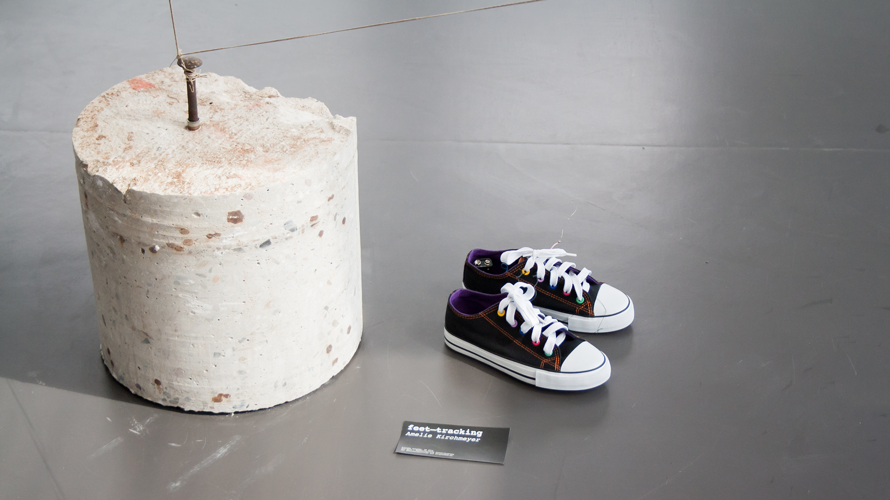
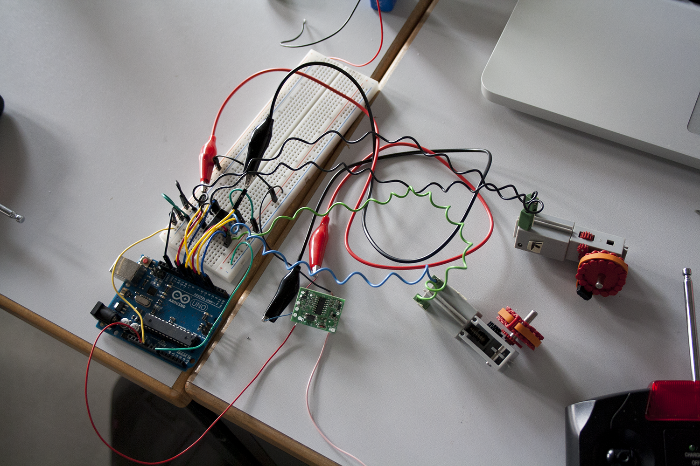
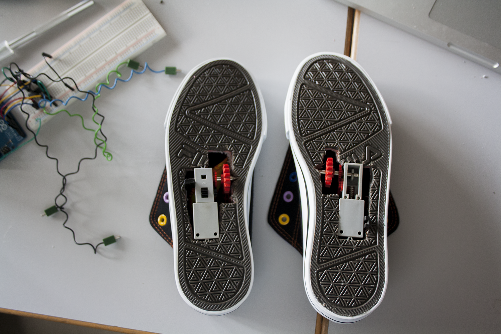

# Remote Controlled Car – Hack

Ein ferngesteuertes Auto war Grundlage des Hardware Hacks. Die Signale der Fernbedienung wurden durch [Fabian](https://github.com/fabiantheblind) durch die Signale in Form von den Besucher- und Klickzahlen der [Website der FH Potsdam](http://www.fh-potsdam.de/) ersetzt. Sie dienen als Input, während der Output eine von mir frei gewählte Visualisierung sein sollte.

So entstanden Schuhe, die die Besucherzahlen veranschaulichen, indem sie Schritte nach vorne sowie nach hinten machen. Die Signale werden minütlich verarbeitet; bei einer höheren Besucheranzahl bewegen sich die Schuhe nach vorne, bei wenig Besuchertraffic nach hinten. 

In die Schuhe verbaut sind ein Arduino UNO, die Platine des ferngesteuerten Autos sowie eine Lötplatine, auf der unter anderem die H–Bridge platziert ist. Diese sorgt dafür, dass die Motoren vorwärts und rückwärts angesteuert werden können.

Die beiden „Walzen“ (Motoren von Fishertechnik) sind genau so platziert, dass sie die Schuhe sowohl nach vorne als auch nach hinten transportieren können.

#### MIT License

The MIT License (MIT)

Copyright (c) 2014 ameliekirchmeyer

Permission is hereby granted, free of charge, to any person obtaining a copy
of this software and associated documentation files (the "Software"), to deal
in the Software without restriction, including without limitation the rights
to use, copy, modify, merge, publish, distribute, sublicense, and/or sell
copies of the Software, and to permit persons to whom the Software is
furnished to do so, subject to the following conditions:

The above copyright notice and this permission notice shall be included in all
copies or substantial portions of the Software.

THE SOFTWARE IS PROVIDED "AS IS", WITHOUT WARRANTY OF ANY KIND, EXPRESS OR
IMPLIED, INCLUDING BUT NOT LIMITED TO THE WARRANTIES OF MERCHANTABILITY,
FITNESS FOR A PARTICULAR PURPOSE AND NONINFRINGEMENT. IN NO EVENT SHALL THE
AUTHORS OR COPYRIGHT HOLDERS BE LIABLE FOR ANY CLAIM, DAMAGES OR OTHER
LIABILITY, WHETHER IN AN ACTION OF CONTRACT, TORT OR OTHERWISE, ARISING FROM,
OUT OF OR IN CONNECTION WITH THE SOFTWARE OR THE USE OR OTHER DEALINGS IN THE
SOFTWARE.