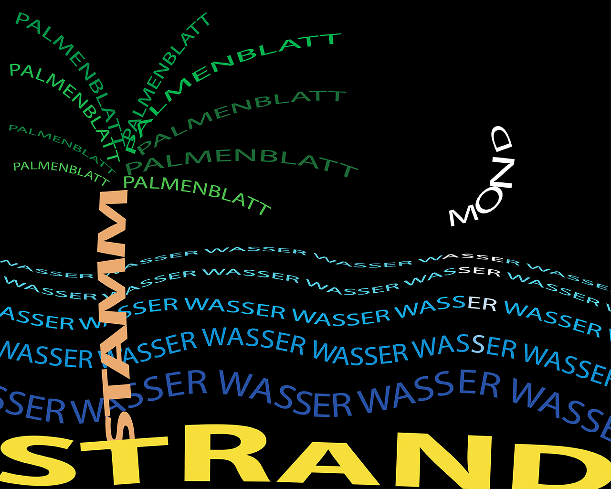
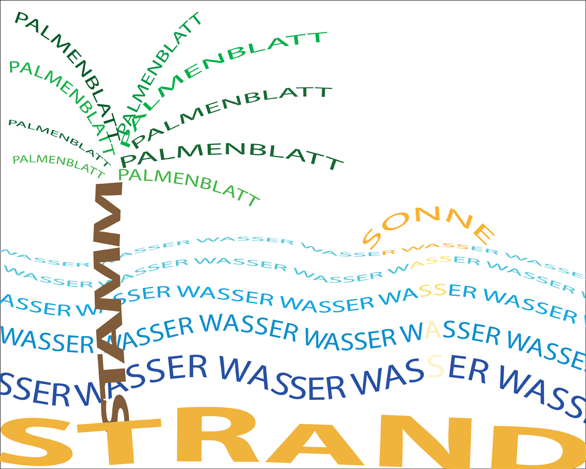
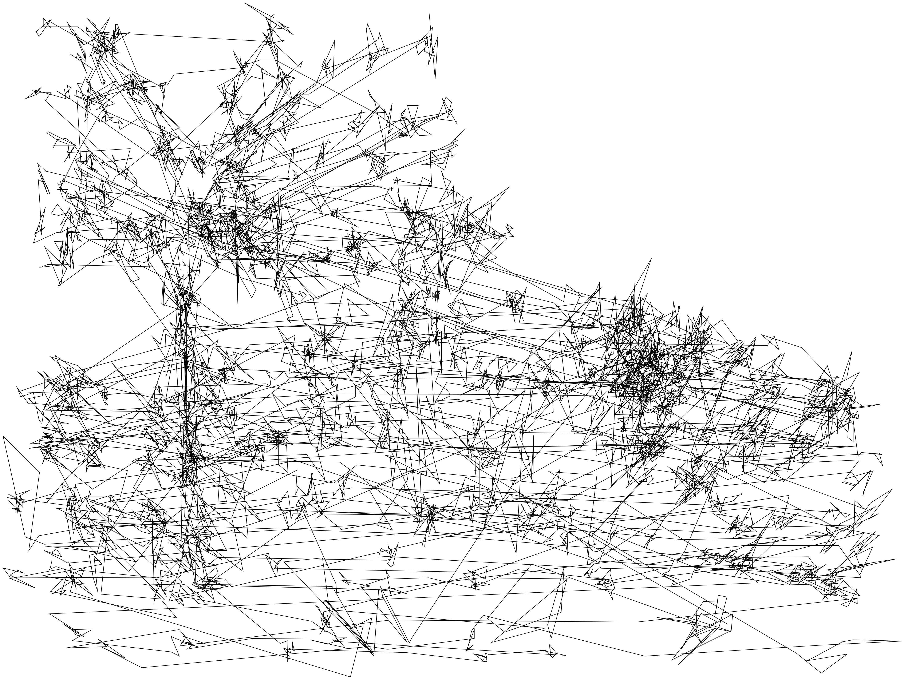
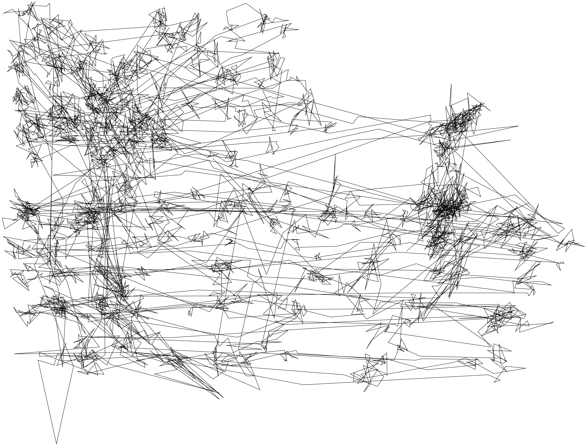

Hello my name is [jannisfeigl](https://github.com/jannisfeigl) and I'd like to say... 

##1. Projekt : _Processing_

Durch kleine Änderungen im Programmiercode, entstehen schnell komplett neue Bilder beziehungsweise Animationen. 
Ich wurde während des Programmierens häufig von den Auswirkungen dieser kleinen Veränderungen überrascht, da die Animation ab einer bestimmten Anzahl von Variablen und Textzeilen für einen Laien schnell unübersichtlich und schwer vorstellbar wird. Jedoch genau in diesem Spiel zwischen Zufall und Kontrolle bestand für mich die Spannung und der Reiz dieser Aufgabe.

!  

!  

####1. Projekt : _Processing Umsetzung_

Mein Ziel war es, verschiedenartige haptische Oberflächen in eine digitale Animation zu übersetzen. 
Mir war es ein Anliegen, die Entwicklung von Technik kritisch zu hinterfragen, indem ich den Kontrast von einer alten Schreibmaschienentastatur zu einer modernen Übersetzertastatur aufzeigte und die Worte „WRONG WORLD“ in einer Animation übereinander lappen ließ.

Es war nicht einfach, die Entscheidung zu treffen, wann das Ziel, bzw. das gewünschte Ergebnis erreicht ist. Mit dieser Abfolge von Bildern konnte ich mich jedoch am ehesten anfreunden. Man kann sich beim Betrachten die dahinterstehende Animation vorstellen und durch die spiralförmige Bewegung der Buchstaben sind interessante Muster entstanden.

_Der dazugehörige Programmiercode:_

*[Button_Sphere](Button_sphere/Button_sphere_finish_4_richtigfresh/Button_sphere_finish_4_richtigfresh.pde)  

  

##2.Projekt : _Eyetracking_

Eyetracking ist eine Technologie, bei welcher Pupillen und deren Bewegung mittels einer speziellen Kamera geortet werden. Sie wird häufig in der Werbung, für Websites etc. genutzt, um die Wirkung und Prägnanz beim Betrachter zu überprüfen. 
Es werden meistens mehrere Probanden gebeten, einen Text, Plakat, Website etc. für eine festgelegte Zeit zu betrachten. Anschließend kann man am PC auswerten, in welcher Reihenfolge Dinge betrachtet wurden, an welchen Stellen das Auge hängengeblieben ist, und wie schnell sich der Benutzer durch die Informationen navigierte.
Bei dieser Aufgabe ging es um einen künstlerischen Umgang mit dieser Technologie. 
Den Betrachter irritieren, überraschen, leiten... der Fantasie waren hierbei keine Grenzen gesetzt.

  

  

#####2.Projekt :_Eyetracking Ergebnis_

Nachdem ich alle ausgewerteten Tracking-Daten übereinander gelegt hatte, sind diese Bilder entstanden. 
Ein Wirrwarr, das viele Assoziationen zulässt. Weiß man jedoch, aus was für Bildern diese so wilden aber doch geradlinigen Strukturen entstanden sind, kann man auch das gewünschte Ergebnis erkennen. 
Interessant war, dass viele Probanden auf der Sonne bzw. dem Mond hängengeblieben sind. Vermutlich wegen dem Kontrast und der etwas aufwendigeren Spiegelung im Wasser. 

  

  

_Der Dazugehörige Programmiercode:_

[Day](Eyetracking_Day.tsv)  

[Night](Eyetracking_Night.tsv)   

##3. Projekt : _Physical Computing_

Damit meine Seifenblasenmaschine die eingehenden Funkbefehle der Website in Seifenblasen übersetzen kann, musste ich die Signale, die in der Platine des Autos ankamen, mit dem Arduino Board auslesen und an Motor und Servo weiterschicken, gesteuert von einem Programmiercode.  
Bei mehr Besuchern sollten größere Seifenblasen entstehen, sprich, die Bügel länger offen bleiben, damit mehr Luft in die Blase kommt. Bei weniger Besuchern eine entsprechend kürzere Öffnungszeit für kleinere Seifenblasen. Dieser Effekt sollte durch eine unterschiedliche Drehgeschwindigkeit des Motors noch verstärkt werden.  

  

_Der dazugehörige Programmiercode:_

*[Button_Sphere](Bubble_box/Bubble_box.ino)  

