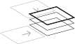

#Pencils
Digitale Übersetzung einer analogen Musteranweisung durch Processing. Idee von **Pencils** ist es, ein Spiel von Eigenständigkeit und Inspiration sichtbar zu machen.

 
*Präsentation im Kurs*

 
*Einsatzmöglichkeiten des Musters*

 
*Version 18 (links) und Version 13 (rechts)*

##Musteranweisung

1. Suche ein leeres Feld heraus, dass an ein anderes, bereits bemaltes Feld angrenzt.

2. Jede Fläche besteht aus n Stiften mit verschiedener Trägheit und Strichstärke. Jeder Stift malt dabei eine Linie.

3. Linien von angrenzenden Flächen werden mit gleichem Winkel und gleicher Stärke weitergeführt.

4. Linien aus der gleichen Fläche werden abgestoßen.

5. Linien aus angrenzenden Flächen werden verfolgt.

 
*Linien vom gleichen Feld werden abgestoßen. (Kreativität)*

 
*Linien von angrenzenden Feldern werden verfolgt. (Inspiration)*

###Zu Punkt 5: „Inspiration“
 
*Gedankliches Model der „Inspiration“.*

Linien aus angrenzenden Feldern werden also nicht nur mit gleichen Winkel und gleicher Strichstärke im neuen Feld weiter gemalt.
Sie dienen gleichzeitig auch als eine Art *Inspiration* für das neu zu bemalende Feld. Am besten vorstellen kann man sich dies wahrscheinlich,
indem man angrenzende Felder gedanklich unter das aktuelle Feld legt. Dabei entstehen mehr oder weniger starke Führungslinien,
die ggf. übernommen werden. So kommt es zu den auffälligen Musterwiederholungen.

---

#####@FH Potsdam, WS 2013/2014
[Eingabe, Ausgabe. Grundlagen der prozessorientierten Gestaltung](https://incom.org/workspace/5122)

by Prof. Monika Hoinkis & Fabian Morón Zirfas

---

#####MIT License

Copyright (c) 2014 Lennart Hildebrandt aka [lennerd](https://github.com/lennerd)

Permission is hereby granted, free of charge, to any person obtaining a copy of
this software and associated documentation files (the "Software"), to deal in
the Software without restriction, including without limitation the rights to
use, copy, modify, merge, publish, distribute, sublicense, and/or sell copies of
the Software, and to permit persons to whom the Software is furnished to do so,
subject to the following conditions:

The above copyright notice and this permission notice shall be included in all
copies or substantial portions of the Software.

THE SOFTWARE IS PROVIDED "AS IS", WITHOUT WARRANTY OF ANY KIND, EXPRESS OR
IMPLIED, INCLUDING BUT NOT LIMITED TO THE WARRANTIES OF MERCHANTABILITY, FITNESS
FOR A PARTICULAR PURPOSE AND NONINFRINGEMENT. IN NO EVENT SHALL THE AUTHORS OR
COPYRIGHT HOLDERS BE LIABLE FOR ANY CLAIM, DAMAGES OR OTHER LIABILITY, WHETHER
IN AN ACTION OF CONTRACT, TORT OR OTHERWISE, ARISING FROM, OUT OF OR IN
CONNECTION WITH THE SOFTWARE OR THE USE OR OTHER DEALINGS IN THE SOFTWARE.

see also <http://www.opensource.org/licenses/mit-license.php>