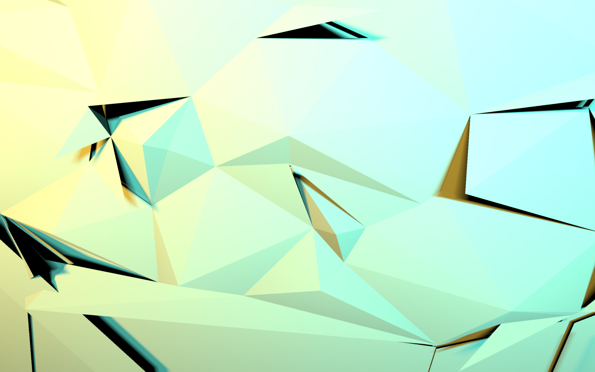
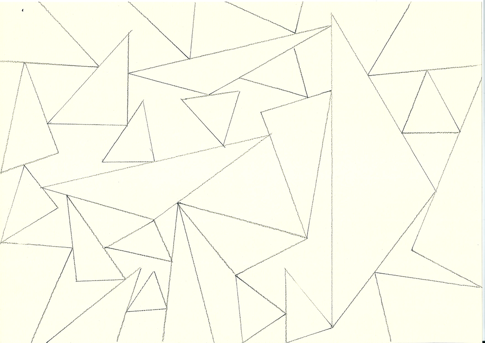
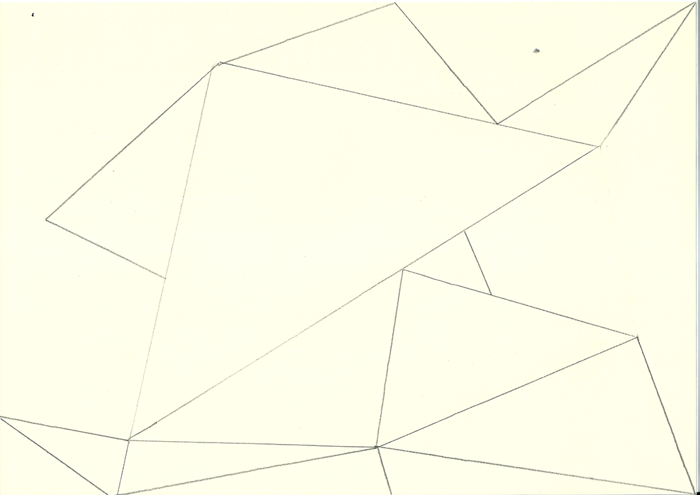
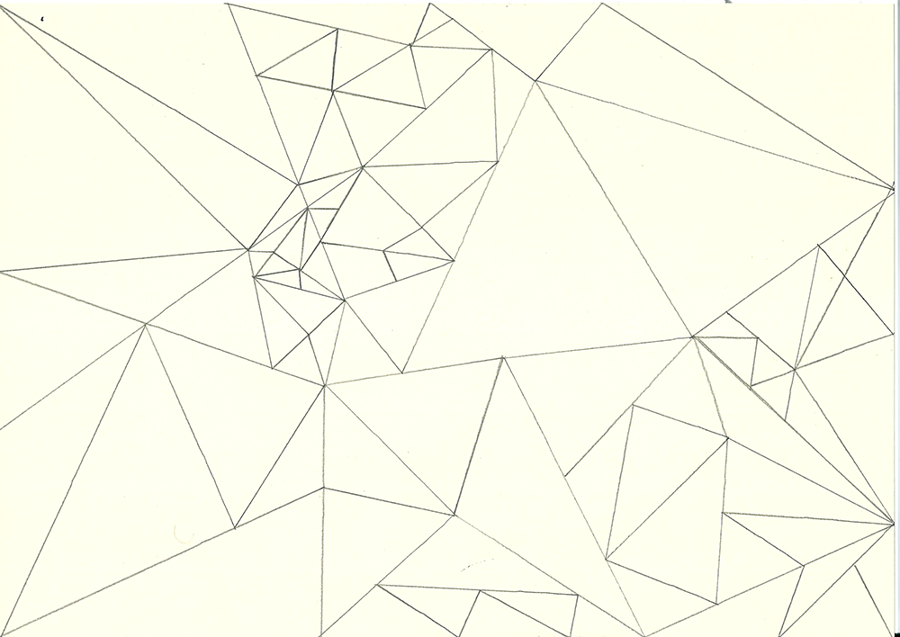
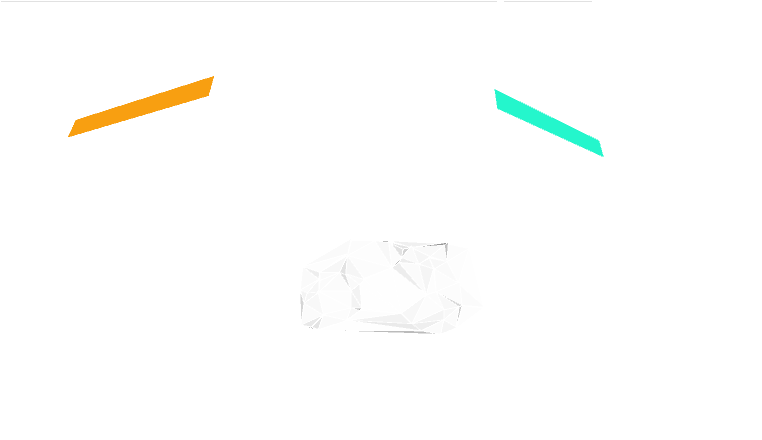
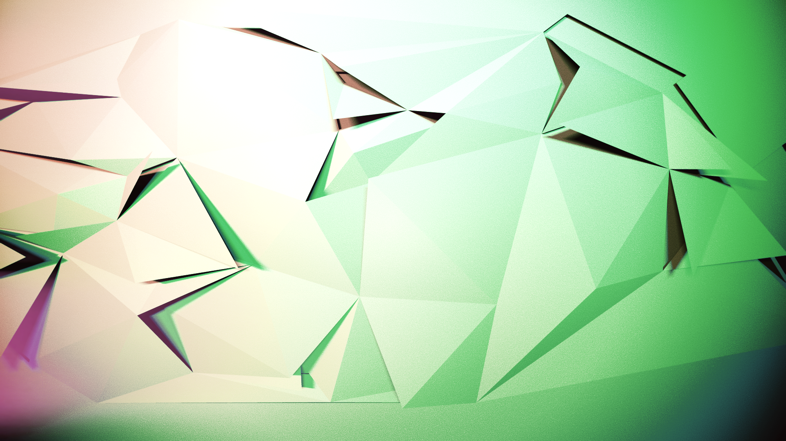
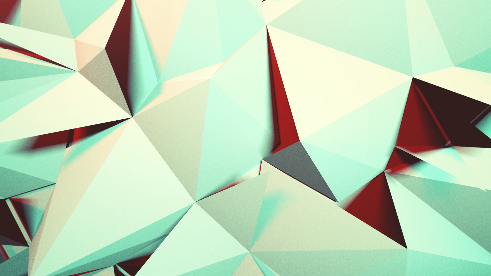
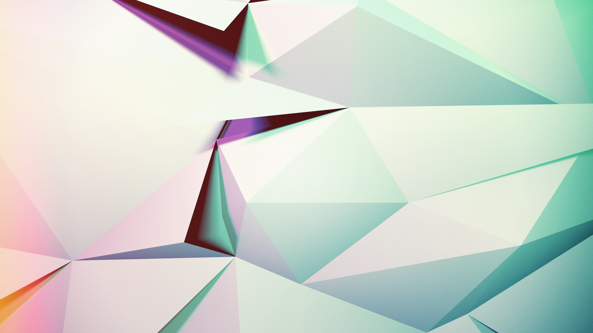

# Voronoi Triangles



## Based on
* [How to use the Toxiclibs Voronoi Class?](http://forum.processing.org/one/topic/toxiclib-voronoi-example-sketch.html)
* [Joons Renderer Wiki](https://github.com/joonhyublee/joons-renderer/wiki)

## Requirements
Joons-Renderer does not work with new versions of processing at the moment. So I used 2.0.3.
[Joons-Renderer Issues](https://github.com/joonhyublee/joons-renderer/issues/7)

* [Processing 2.0.3](https://processing.org/download/?processing)
* [Joons Renderer](https://github.com/joonhyublee/joons-renderer)
* [toxiclibs](http://toxiclibs.org/downloads/)
* [peasycam](http://mrfeinberg.com/peasycam/)


## Analog Assignment

"Fill the paper with triangles, which will not overlap, but touch each other."


## Analog Results








## Code-Analysis



```java
import toxi.geom.*;
```

Needed for Vec2D/3D-Functions


```java
import toxi.geom.mesh2d.*;
```

Needed for Voronoi-Function


```java
import peasy.*;
```

Needed for PeasyCam


```java
import joons.JoonsRenderer;
```

Needed for Joons Renderer / Sunflow


```java
float fov = PI / 1.5;
float aspect = 4/3f;
float zNear = 5;
float zFar = 10000;
```

Variables for perspective function from processing.
does work in combination with peasycam.

i used a large field of view, to get a fish-eye-styled
camera and some distorted lines.


```java
float DSIZE = 1000000;
float noiseValue = 0.0;
int points = 50;
```

Variables for the voronoi.
DSIZE is the diameter of the invisible circle: [Deluanay Triangulation & Voronoi](https://www.youtube.com/watch?v=PdV7sCb0k3M) see the circle at 0:07?
noiseValue is a standard-value of zero, which gets multiplied for a random z-height on the first-triangle z-coordinate. points is the count of points which will be generated in the voronoi diagram.


```java
String timestamp;
```

Needed for [Juris saveFrame-snippet](https://incom.org/post/132199)


```java
Voronoi voronoi;
PeasyCam cam;
JoonsRenderer jr;
```

Initialize objects.


```java
void setup() {
  size(1280, 800, P3D);
  smooth();
```

Set size to my resolution, to use as a wallpaper or something like that.
I rendered later images on my windows maschine and increased the size for printing, to get effective 150 ppi.


```java
  jr = new JoonsRenderer(this);
```

Called JoonsRenderer constructor function with "this" to initialize the renderer.


```java
  jr.setSizeMultiplier(2);
  // jr.setSampler("bucket");
  // jr.setSizeMultiplier(1);
  // jr.setAA(0, 2, 4);
  // jr.setCaustics(20);
  // jr.setDOF(130, 3);
```


Set render-settings for JoonsRenderer.
setSizeMultiplier is used to get unpixelated lines. in fact it renders the image in the resolution of 2560x1600 and scales it back/down to the viewport.

the uncommented settings could be used instead, but it looked like it worked faster on my maschines.

setSampler("bucket") is another raytrace method. standard-value is ipr.
setAA is Antialiasing.
setCaustics() i think this does only affect object with glass-material (refraction)
setDOF() is a setting for depth of field


```java
  cam = new PeasyCam(this, width / 2, height / 2, 0, 500);
```

Initialized PeasyCam with camera-positions and a distance value.


```java
  voronoi = new Voronoi(DSIZE);
```

Initialized a Voronoi with the diameter-size value.


```java
  noiseSeed(300);
```

Called the noiseSeed()-function to get equal noise-values for each run.


```java
  for(int x = 0; x < points; x++) {
    voronoi.addPoint(new Vec2D(random(0, width), random(0, height)));
  }
}
```

for-loop which adds in this case 50 (see points var) random points on the canvas.


```java
void draw() {
  jr.beginRecord();
```

JoonsRenderer beginRecord() function will attach all objects which will be drawn till the endRecord() function is called.


```java
  background(0);
  jr.background(0);
  perspective(fov, aspect, zNear, zFar);
  lights();
```

Set background AND JoonsRenderer background to black.
Called the perspective function with the field of views vars.
Called lights function, to see a basic shading on the voronoi in the preview-mode.


```java
  jr.fill("light", 89, 57, 6, 50);
  int z = 50;
  beginShape(QUADS);
    vertex(-z - 500, -z, 1000);
    vertex(-z - 500, z, 1000);
    vertex(z, z, 1200);
    vertex(z, -z, 1200);
  endShape();
 ```
 
 ```java
  jr.fill("light", 15, 102, 85, 50);
  int o = 50;
  beginShape(QUADS);
    vertex(900, -o, 1200);
    vertex(900, o, 1200);
    vertex(1400, o, 1000);
    vertex(1400, -o, 1000);
  endShape();
```

```java
  // plane
  jr.fill("diffuse");
  int w = 10000;
  beginShape(QUADS);
    vertex(w, -w, -5);
    vertex(-w, -w, -5);
    vertex(-w, w, -5);
    vertex(w, w, -5);
  endShape();
```

This is the code which draws 2 light-strips and a plane.
One light will be a cold light and one a warmer one, to get some nice gradients and shadows.
The plane is added due to the nature of the voronoi generated plane, it should prevent visual bugs and should serve as a background, if the triangle-mesh has been destroyed with the random z-values and generate holes.


```java
  stroke(255, 255, 255);
```

Set stroke-color for the triangles. Only important for the preview-mode


```java
  for (Triangle2D t : voronoi.getTriangles()) {
    Vec3D first = t.a.to3DXY();
    Vec3D second = t.b.to3DXY();
    Vec3D third = t.c.to3DXY();
```

```java
    first.z = noise(noiseValue) * 50;
```

```java
    // set material to diffuse
    jr.fill("diffuse", 255, 255, 255);
```

```java
    beginShape(TRIANGLE);
      vertex(first.x, first.y, first.z);
      vertex(second.x, second.y, second.z);
      vertex(third.x, third.y, third.z);
     endShape();
  }
```

Here we get the voronoi-triangle points and multiply the z-value for the first with a noisy-random-value. After that, I set the material to diffuse (like the plane) to get rendered in JoonsRenderer. In the old implementation I added the newly generated face to a TriangleMesh
from toxiclibs, but i didnt figured out, why the mesh wont be rendered. So im drawing the trinagles for myself, which worked with the JoonsRenderer in this case.

```java
  jr.endRecord();
  jr.displayRendered(true);
}
```

End the record from JoonsRenderer and display the rendered image, if done.


```java
void keyPressed() {
  if (key == 'n') {
    voronoi = new Voronoi(DSIZE);
    for(int x = 0; x < points; x++) {
      voronoi.addPoint(new Vec2D(random(0, width), random(0, height)));
    }
  }
  if (key == 'r') {
    jr.render();
  }
  if (key == 'p') {
    timestamp = year() + nf(month(),2) + nf(day(),2) + "-" + nf(hour(),2) + nf(minute(),2) + nf(second(),2);
    saveFrame("lines-" + timestamp + ".png");
  }
}
```

There are three buttons in the keyPressed function:
'n' to generate a new voronoi in the preview-mode.
'r' to start the rendering of the image. the renderer will renderer what you see through the camera.
'p' to safe a png file with a timestamp (snippet from juri)


## Digital Results








## Licence

DO WHAT THE FUCK YOU WANT TO PUBLIC LICENSE

Version 2, December 2004

Copyright (C) 2014 natael

Everyone is permitted to copy and distribute verbatim or modified copies of this license document, and changing it is allowed as long as the name is changed.

DO WHAT THE FUCK YOU WANT TO PUBLIC LICENSE
TERMS AND CONDITIONS FOR COPYING, DISTRIBUTION AND MODIFICATION
http://sam.zoy.org/wtfpl/

`0. You just DO WHAT THE FUCK YOU WANT TO.  `