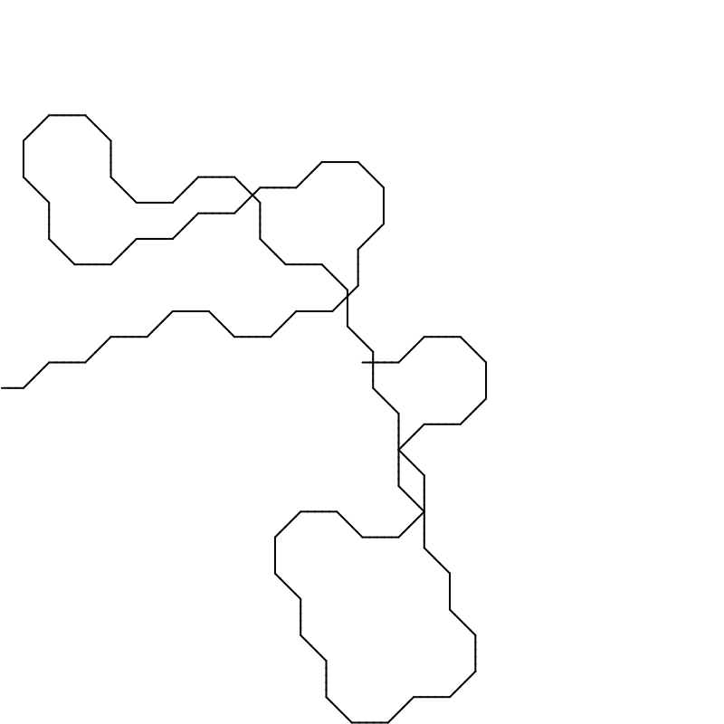
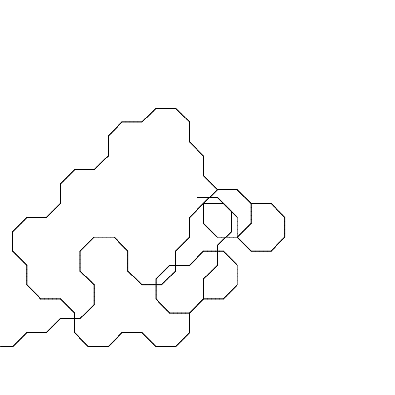

# Pattern Procedure

## Analoge Zeichenanweisung
Lege ein Din-A4-Blatt im Querformat vor dich. Zeichne ca. 3cm lange Linien, die jeweils am Ende im 45° Winkel abknicken. Beginne im Mittelpunkt des Blattes.

---
Based on ["PROCESSING – TURTLES, ANTS AND BROWNIAN WALKERS"](http://www.supermanoeuvre.com/blog/?p=671)
