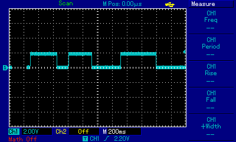
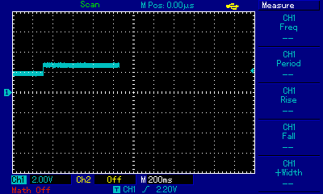
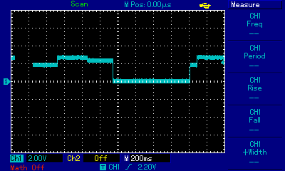

# RCC-Hack

## Idee:
Visualisierung der Besucherzahlen der FHP-Website mittels von verschiedenen Höhen von Wasserwellen (aka "Wellenbad").

## Oscilloskopaufnahmen:

Zur Untersuchung der Signale der Autoplatine.

 

