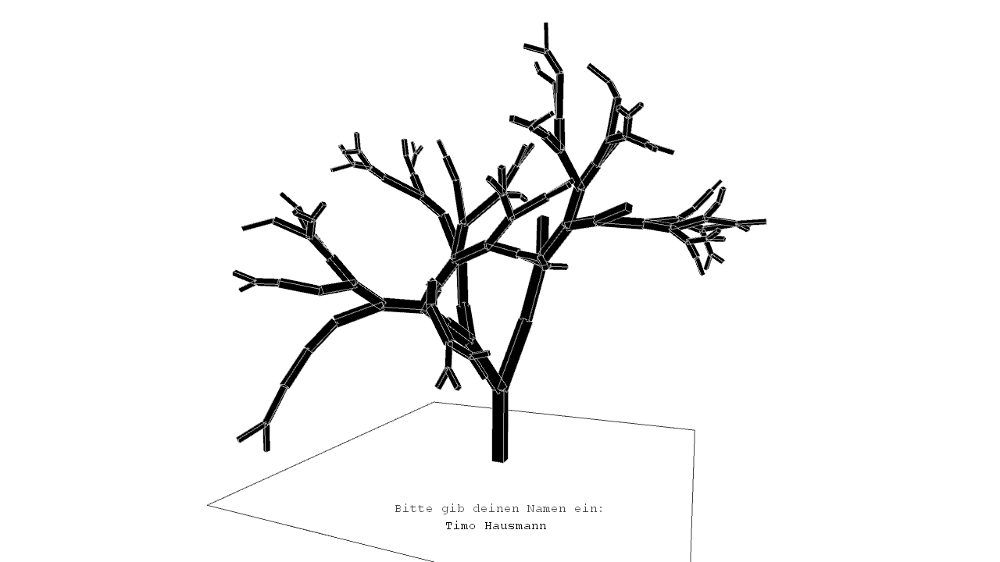

# Fractaltree
Digitale Variante einer analogen Zeichenanweisung

## Analoge Zeichenanweisung
1. Lege ein A4-Blatt quer vor dich
2. Zeichne eine vertikale Linie nach oben, beginnend mittig am unteren Blattrand, nicht länger als dein kleiner Finger
3. Zeichne vom oberen Ende der Linie ausgehend zwei weitere Striche, sodass eine Verzweigung entsteht. Die Länge der neuen Linien ist beliebig, die Richtung sollte nicht mehr als 45° von der Ursprungslinie abweichen
4. Wiederhole Schritt 3 beliebig oft, ausgehend von beliebigen Linien, die noch keine Verzweigung haben
5. Zeichne mit dem anderen Stift an alle Linienenden, von denen keine Verzweigungen abgeht, einen Kreis, nicht größer als deine Fingerspitzen

## Digitale Abwandlung
* Schritt 5 wurde in der finalen Version weggelassen, ist über die Klasse "Fruit" aber theoretisch möglich
* Nutzung des dreidimensionalen Raums
* Parametrisierung durch Namenseingabe
  * Länge des Namens bestimmt Anzahl der Verzweigungen
  * Für jeden Namen wird ein einzigartiger Baum generiert

## Interaktion
* Namenseingabe: Tastatur
* Kameradrehung: linke Maustaste
* Kamerazoom: Mausrad
* Screenshot erstellen: Enter

## Benötigte Processing Libs
* [PeasyCam](http://mrfeinberg.com/peasycam/)

## Ressourcen
* [Fraktalbäume bei Rosettacode](http://rosettacode.org/wiki/Fractal_tree)

---

Copyright © 2014 Timo Hausmann | Lizensiert unter der [MIT License](http://opensource.org/licenses/mit-license.php)
