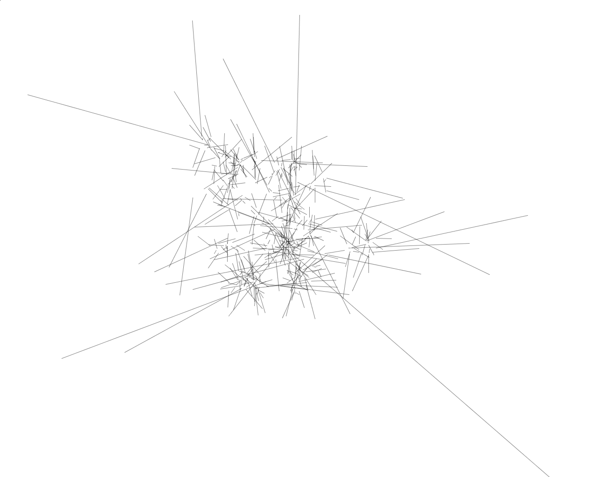

# Eyetracking 1
Plottet Eyetracking-Daten, wobei Blicksprünge zu Beschleunigung führen.

---

Copyright © 2014 Timo Hausmann | Lizensiert unter der [MIT License](http://opensource.org/licenses/mit-license.php)
