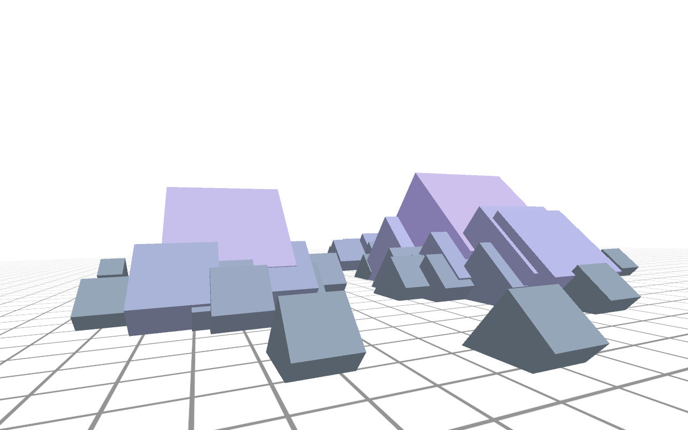

# Eyetracking 2
Plottet Eyetracking-Daten als dreidimensionale Objekte auf einer Rasterfläche. In der Paint-Methode der Node.pde sind verschiedene Objekttypen durch Auskommentieren verfügbar.

---

Copyright © 2014 Timo Hausmann | Lizensiert unter der [MIT License](http://opensource.org/licenses/mit-license.php)
