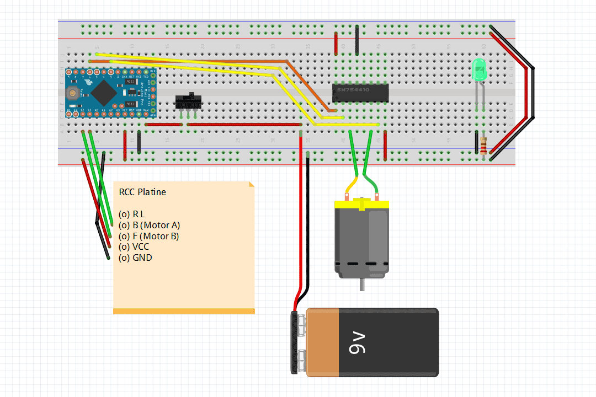

# Motor In
Dieser Sketch lässt einen Motor je nach Eingangssignal in die eine oder andere Richtung drehen.

## Anwendungsszensario
Je nach Eingangssignal an zwei digitalen Pins wird das Ausgangssignal an drei analogen Pins gesteuert. Die Output-Signale lassen einen Motor über einen H-Bridge IC nach links oder rechts in geringer Geschwindigkeit drehen. 

Im Rahmen des RCC-Projekts stellte das Motorsignal (vorwärts/rückwärts) der RCC-Platine das Eingangssignal dar. Das Lenksignal (links/rechts) wird in diesem Setup außer acht gelassen.

Der Umweg über Arduino bietet die Möglichkeit, die Motorgeschwindigkeit exakt zu steuern. Der gewünschte Effekt wäre sicher auch ohne Arduino über Zahnräder oder Widerstände erreichbar gewesen.

---

Copyright © 2014 Timo Hausmann | Lizensiert unter der [MIT License](http://opensource.org/licenses/mit-license.php)
