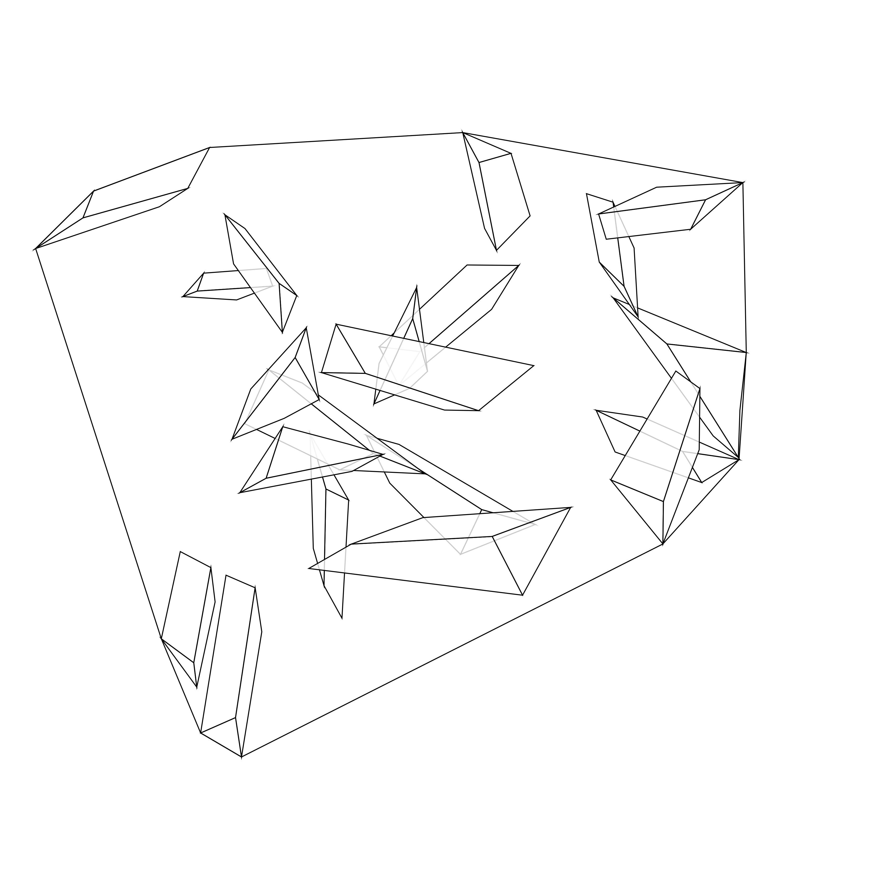
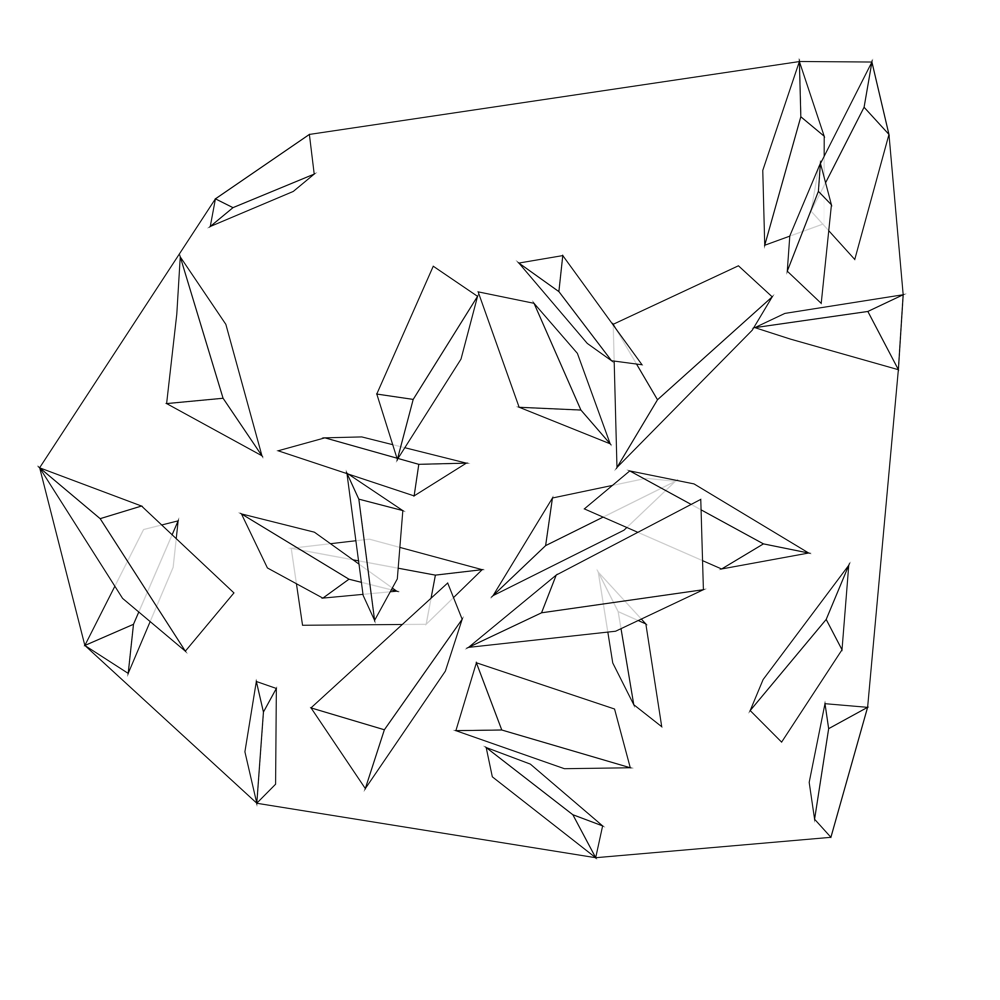
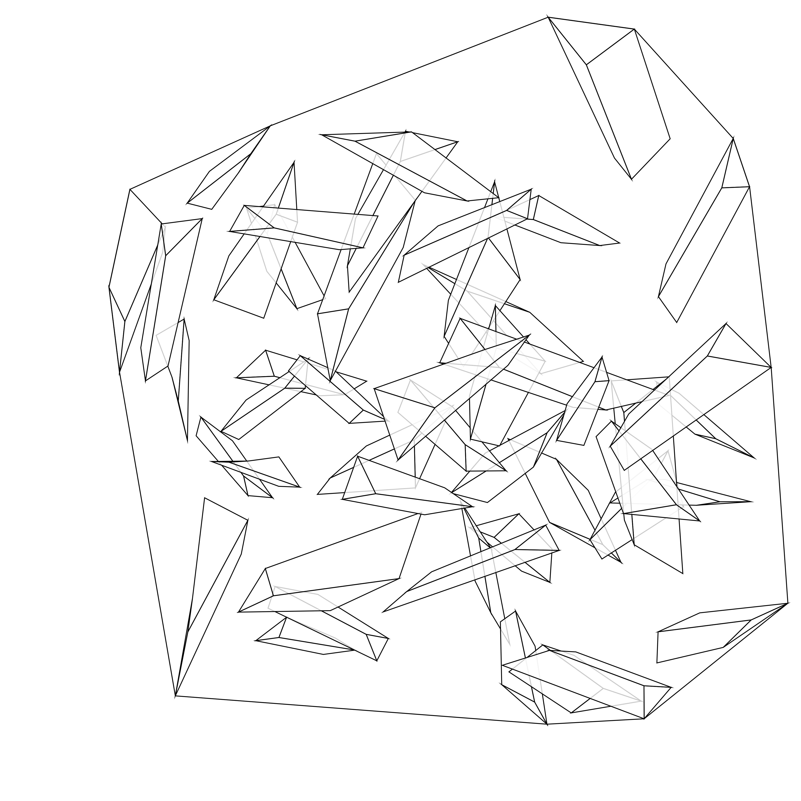
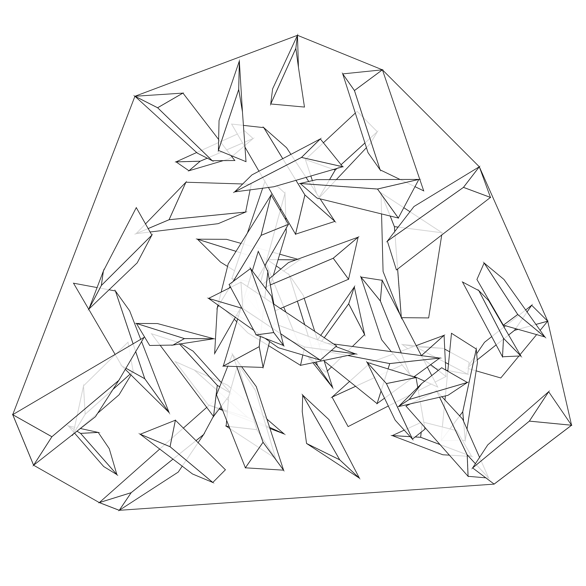
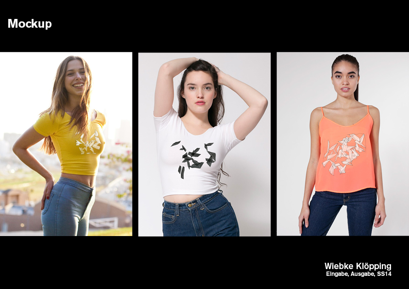

##Lines  

Let's start ...

###Aufgabenstellung
Bei der Aufgabe sollte einen »genetischen Code« eines zweidimensionalen Musters erstellt werden.  
Als erstes wurde eine textliche Zeichenanweisungen verfasst, welche den Genotyp des Konzeptes darstellt.  
Anschließend sollte diese Anweisung von mehreren Personen ausgeführt werde. Die gezeichneten Ergebnisse den stellen folgich den Phänotyp des Konzeptes dar.

###Musteranweisung
Setzte nach jedem Punkt die Anweisung direkt um. 

1. Zeichne mit Lineal und Bleistift mindestens fünf gerade Linien. Die Linien dürfen sich dabei nicht kreuzen. Sie können willkürlich auf dem Blatt platziert werden.

2. Zeichne jeweils am Anfangs- und Endpunkten der Linien zwei weiter Geraden. Keiner der Linien dürfen sich dabei kreuzen.

3. Verbinde nun alle Anfangs- und Endpunkten der neuen Linien miteinander, sodass geschlossen Flächen entstehen. Auch die alten Anfangs- und Endpunkten der Ursprungslinien  können mit verbunden werden. Nach wie vor dürfen sich keine der Geraden kreuzen. 

4. Es soll am Schluss eine geschlossene Fläche, welche willkürlich aus geometrischen Flächen zusammengesetzt ist, entstanden sein.

###Generierte Beispiele
  
  
  
  
###Anwendungsbeispiel

#####License

