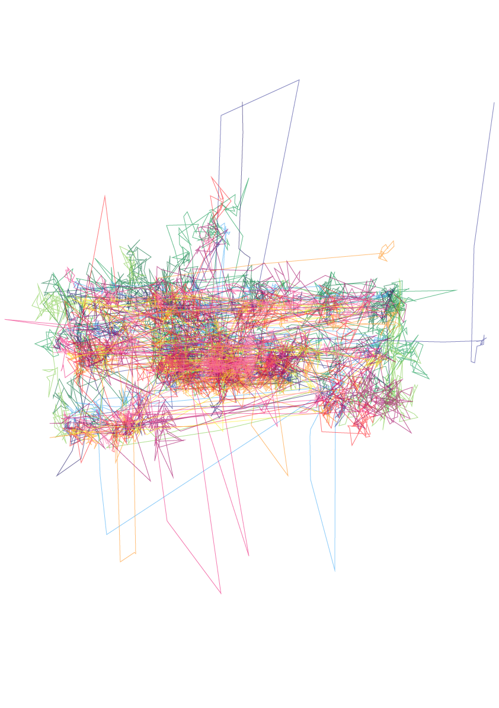
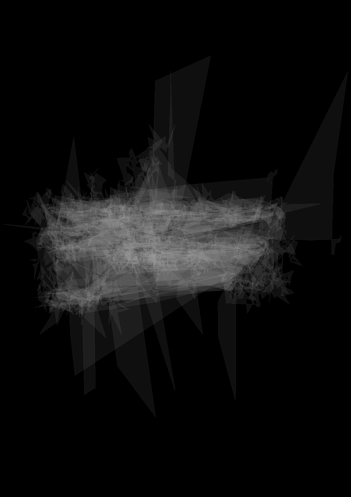
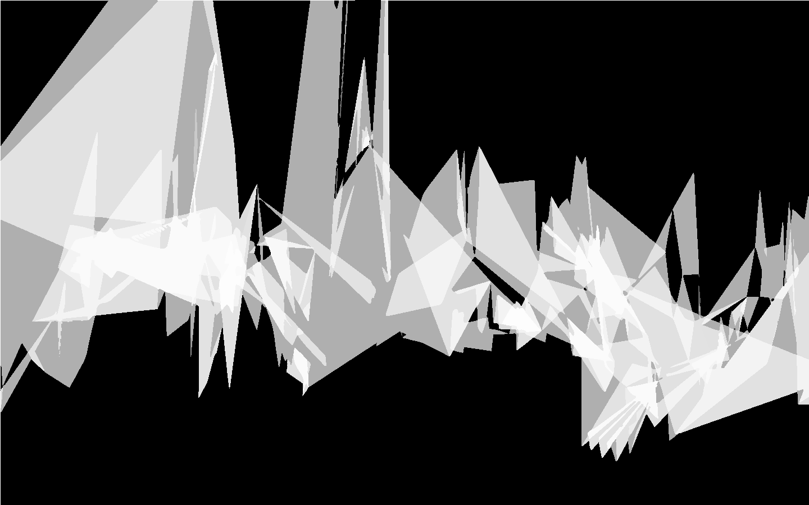
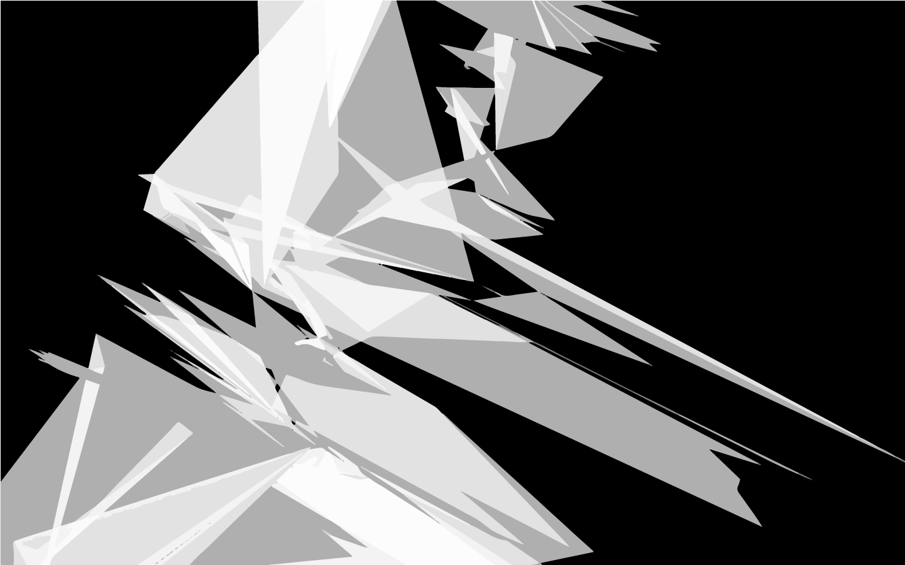
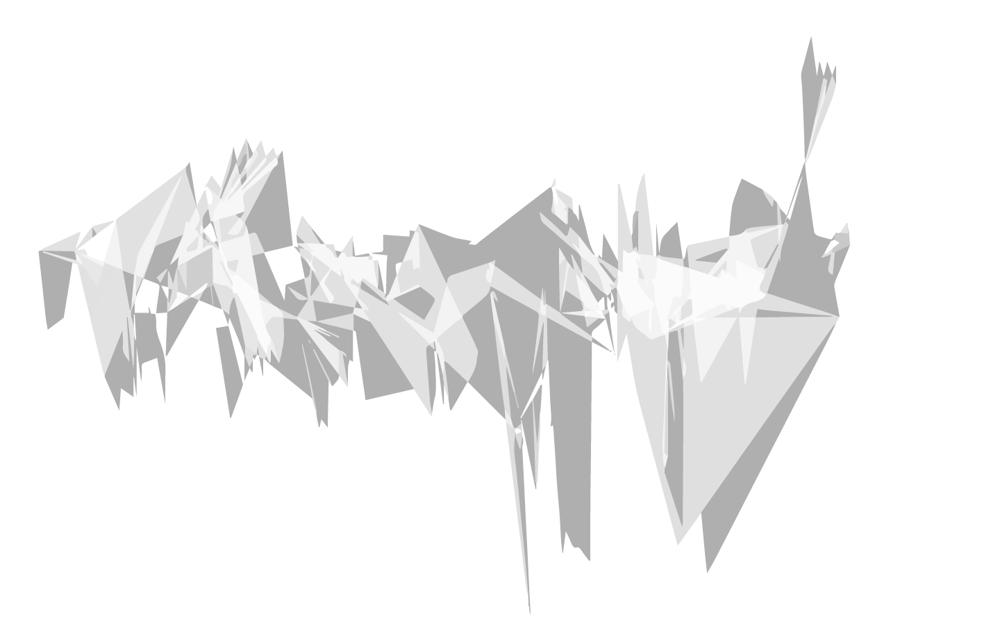
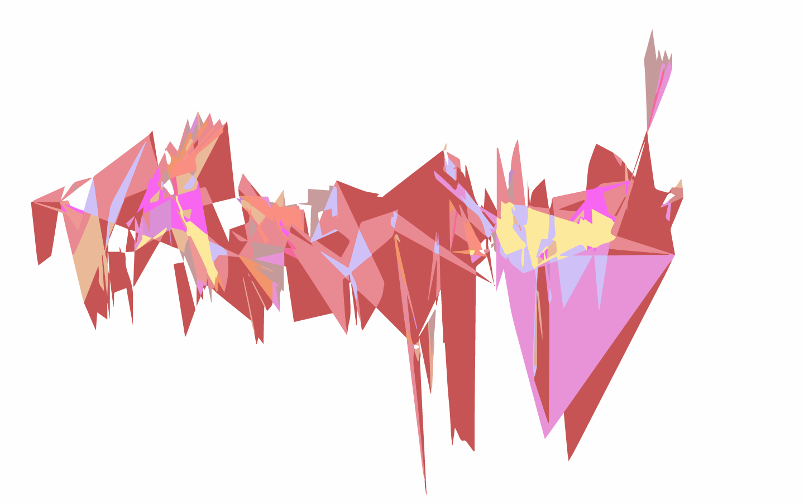

##xx  

Take a look ...

###Aufgabenbeschreibung
Bei dieser Aufgabe haben wir mit den Mitteln des Eyetracking-Labores gearbeitet. Zu Beginn sollte jeder einen Text aussuchen, welchen er seinen Probanden im Eyetracking Labor zum Lesen gibt. Dieser war frei wählbar. Außerdem sollte dazu eine Leseanweisung formuliert werden, wie die Probanden den Text zu lesen haben. Diese Textanalyse mussten wir im Labor von mehreren Testperson ausführen lassen. Durch die Aufnahme ihrer Augenbewegungen beim Lesen wurden individuelle Illustrationen erzeugt.
Aus Bild und Originaltext sollte nun eine klassisch gestaltete Bild-Textkombination in Form eines Plakates erstellt werden.

###Umsetzungs-Variante01

*Zu lesender Text*

*Alle Lesepfade der Versuchspersonen*

*Beispiel für Illustration*

*Plakat Beispiel-01*

*Plakat Beispiel-02* 

###Umsetzungs-Variante02
  

*Mikro-Perspektiven*

*Illustration für Schmuck*

*Illustration Beispiel-farbig*

  
###Anwendungsbeispiel

*Mittels der Eytracking-Daten könnten Kristalle aus Glas generiert werden, welche sich als Schmuck tragen lassen.*

#####License

