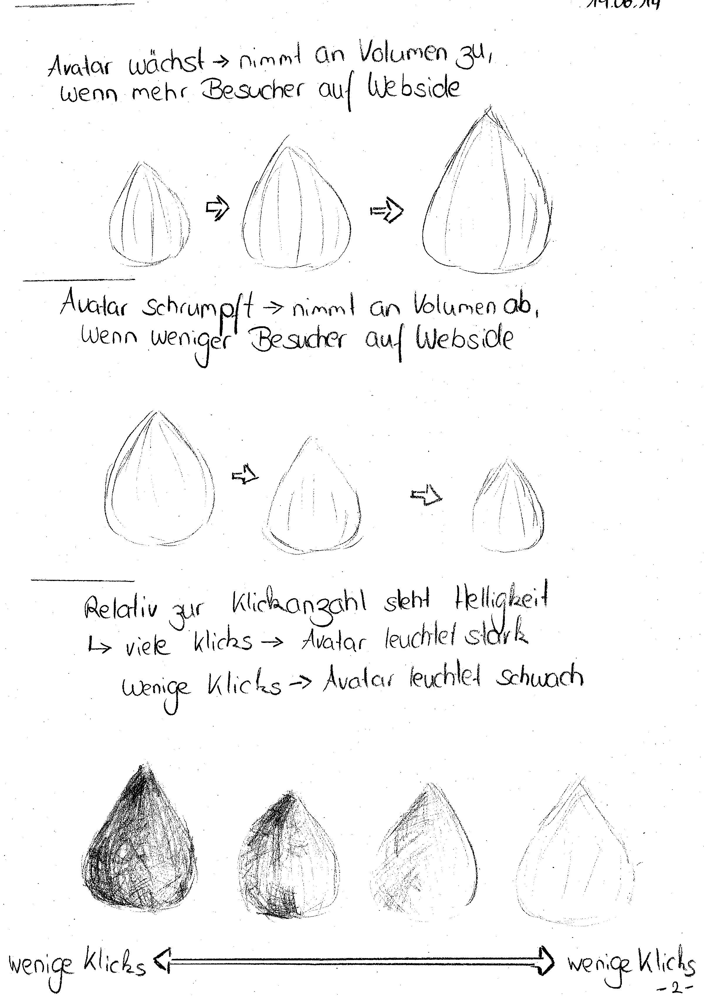
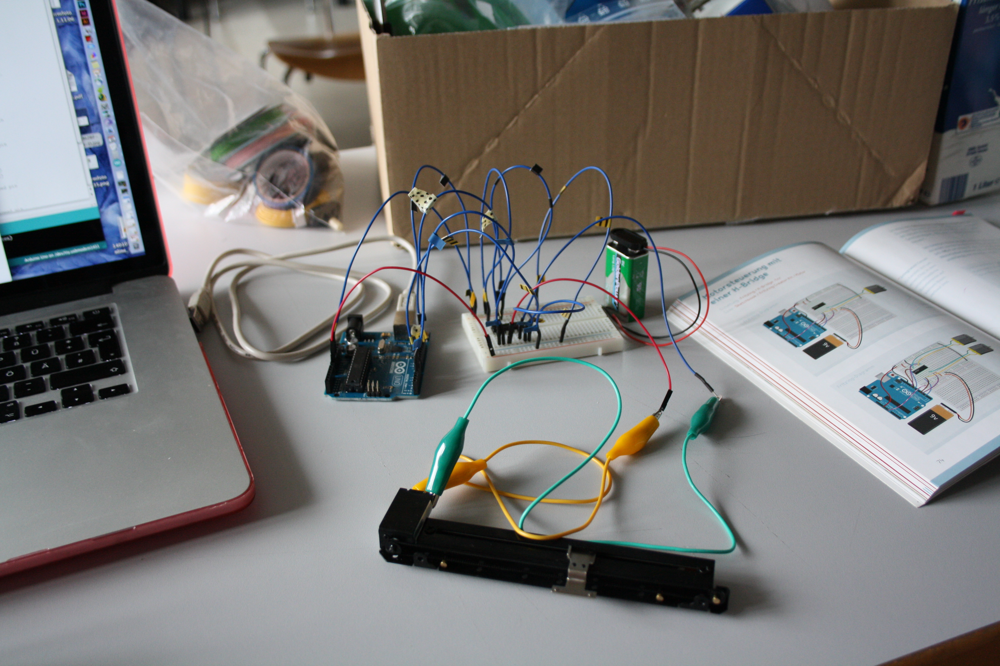
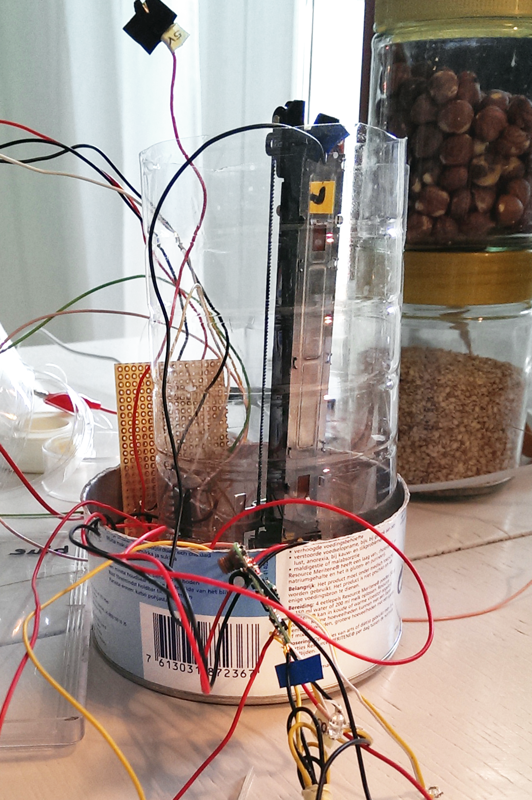
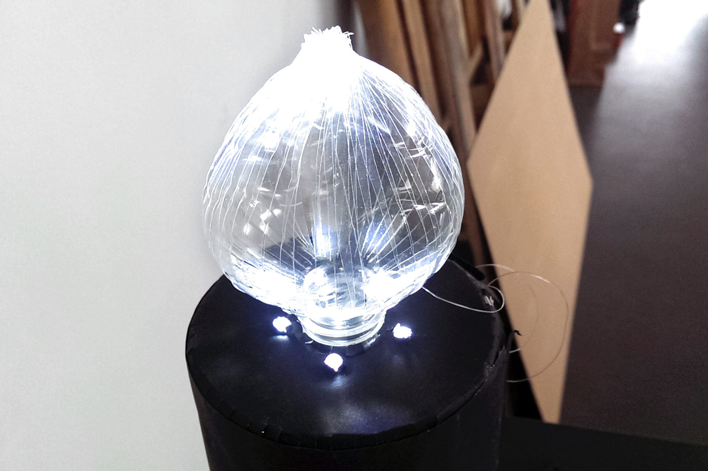

##Data visualization by hacking a remote controlled car 
 
Let's hack ...
###Aufgabenstellung
Das Ziel dieses Projektes bestand darin eine physikalische, mechatronische Informationsvisualisierung der Besucherdaten der neuen FHP Website zu gestalten und zu realisieren. Es sollte physisch erfahrbare und interessante Art der Visualisierung der Information entstehen.

**INPUT**  
Die Besucherdaten wurden über das Webanalyse-Tool PIWIK erhalten. Da aus Datenschutzgründen nicht die Rohdaten zur Verfügung gestellt werden konnten, wurden die Besucherdaten der FHP Website über ein von Fabian aufgesetztes Framework verteilt. Alle Teilnehmer haben also mit der selben Datengrundlage gearbeitet.

**OUTPUT**  
Die Gestaltungsaufgabe und Gestaltungsfreiheit/-herausforderung bestand in der Visualisierung der Ausgabe. Dabei sollten wir uns mit den Fragen auseinandersetzen, wie und mit welchen Materialien, Objekten und (gehackten) Geräten auf physische Art und Weise der Besuchertraffic einer Website dargestellt werden kann. Eine genaue Lesbarkeit der Information musste nicht erhalten bleiben, es sollte im Kern darum gehen, den Aspekt der Aktivität auf der Website durch physische Bewegung zu visualisieren.  
Für den physischen Output, also die Informationsvisualisierung haben wir auf der Grundlage von einem Readymade (ein ferngesteuertes Spielzeugauto) gearbeitet.  
In diesem Kontext bildete der RCC Hack das Hardware-Framework und lieferte uns auf einfache Weise:

1. Stromversorgung
2. DC Motor (Drehbewegung vorwärts und rückwärts)
3. An/Aus Pin mit der Möglichkeit, jedes elektronische Gerät oder jeden Aktuator daran anzuschliessen.
4. Fernsteuerung bzw. Funkverbindung: Webdaten werden per Funk an das gehackte Auto gesendet. 

Die Logik ist dann:

* Besuchertraffic erhöht sich = Motor dreht vorwärts  
* Besuchertraffic wird weniger = Motor dreht rückwärts  
* Absolute Klicks auf der Website = an/aus Impuls auf Pin  

*Abgeleitet von Quelle: https://incom.org/workspace/5122; 5. Juni 2014 um 13:27 Uhr; Monika Hoinkins*

###Konzept
Meine Idee bestand darin, einen Avatar für die Webseite zu bauen, welcher den Besuchertraffic durch Wachstum veranschaulicht. Er sollte eine möglichst natürliche, charmante, liebliche wie auch feine Gestalt haben, wodurch sich der Betrachter emotional angesprochen fühlt. Ergänzend zum Wachstum sollte die Klickanzahl durch Lichtintensität dargestellt werden.
  

###Umsetzung
Auf der Suche nach geeignetem Material bin ich an einem Getränkemarkt vorbei gegangen, was mich dazu animiert hat, den Prototypen aus einer PET Flasche zu bauen. Weil dieser bei der ersten Besprechung unserer Ideen im Kurs sehr positive Resonanz bekommen hat, habe ich für das weitere Vorgehen PET als meinen Werkstoff beibehalten.

Um den Prototypen interagieren zu lassen, habe ich einen linearen Servomotor und ein Arduino-Board benötigt. Da es sich bei dem Servomotor, welchen ich gekauft hatte, tatsächlich um ein Potentiometer handelte, konnte man mit Hilfe des Arduinos abfragen, wo sich der Regler des Motors gerade befindet. Die Stelle, an dem sich der Regler befindet, wird über die Abfrage des Widerstandes in Ohm wiedergegeben. Befindet sich der Regler in der Mitte entspricht dies einem Widerstand von 512 Ohm, an der niedrigsten Stelle 0 und an der höchsten Stelle 1024 Ohm.
Um alle elektronischen Komponenten in eine sinnvolle Anordnung zu bringen, wurde zunächst mit Breadboard (Steckplatine) und Stecklitzen (flexible Drähte) gearbeitet. Anschließend habe ich meine elektrische Schaltung auf einer Leiterplatte nachgelötet.
  

*Potentiometer*  

*Gelötete Platine* 

*Arduino Board mit Empfänger*

Um nun den Protypen bei erhöhter Besucheranzahl wachsen und verminderten Besucheranzahl schrumpfen zu lassen, war für diese Anweisung ein erhebliches Maß an Programmierung notwendig. Mein ursprüngliches Konzept bestand darin, dass sich der Motor jeweils langsam ein kurzes Stück vorwärts oder rückwärts drehen sollte, sodass ein möglichst organisches Wachstums des Web-Avatars erzeugt wird. Allerdings war diese Art, Bewegung zu programmieren, recht problematisch,was unter anderen an merkwürdigen Eigenarten des Motors lag. Auch bestand eine Schwierigkeit darin, dass die Signale für Vorwärts und Rückwärts jeweils durchgehend eine Minute lang gesendet wurden.

Aus diesem Grund musste das Konzept nochmals überarbeitet werden, sodass sich bei der Präsentation der Regler entweder zwischen der Mitte und der höchsten Stelle oder der Mitte und der niedrigsten Stelle des Potentiometers ohne Unterbrechungen bewegt hat. Folglich hat der Avatar bei erhöhtem Besuchertraffic in gleichmäßigen Intervallen sein maximales Volumen (ovaler Körper) angenommen. Dagegen kennzeichnete seine Form bei wenigeren Besuchen ein flaches Erscheinungsbild (plattgedrückter Körper).

*Aufbau Avatar mit Technik bei Präsentation*

Bei der Präsentation hat leider mein Konzept nicht richtig funktioniert, da der Motor des Potentiometers zu schwach für den PET-Avatar war - was wir allerdings erst kurz vom Vorführen festgestellt haben. Als Notlösung habe ich dann das Gehäuse, in welchem sich Motor und Technikkomponenten befunden haben, aufgeschnitten, sodass das Publikum die Mechanik nachvollziehen und wenigstens die Bewegung des Reglers sehen konnte.

*FHP Web-Avatar*
  
###Weitere Aufnahmen

**

#####License

