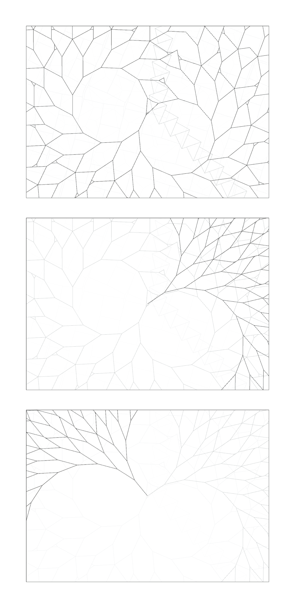

# LineTree
----------------------------------

LineTree is the digital implemetation of an analog pattern instruction, created in context of the course *Input/Output* at FH Potsdam.

The analog instructions were:
- draw a line
- at the end of the line, two new lines arise
- lines must not cross each other

The digital implementation also needs to fullfill following additional rules:
- keep the spread angle constant
- all lines share the same length 

The implementation is written in Processing.

## Results

## Try it

If you want to try LineTree yourself, download [Processing](http://www.processing.org/) and open and run the LineTree/LineTree.pde file.

## Info

This student research project was created in context of the course [Eingabe, Ausgabe. Grundlagen der prozessorientierten Gestaltung](https://incom.org/workspace/5122) at [University of Applied Sciences Potsdam](http://design.fh-potsdam.de).

----------------------------------
Copyright © 2014 Felix Leupold (xiel)

This work is free. You can redistribute it and/or modify it under the
terms of the Do What The Fuck You Want To Public License, Version 2,
as published by Sam Hocevar. See http://www.wtfpl.net/ for more details.

