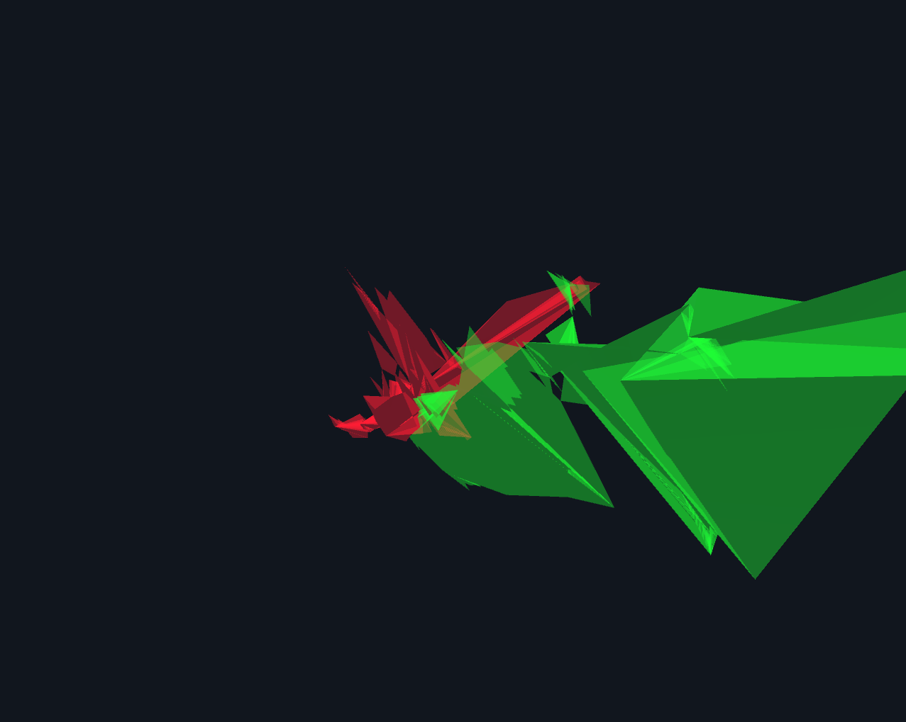

# EyeTracking Sculpture
----------------------------------
This processing sketch creates a three dimensional object from eyetracking data.

The x- and y-axis correspond with the image axis, the z-axis depends on the fixation duration of a gaze point. The longer fixation duration was, the deeper the point is rendered.

## Sample Result

## Try it

This processing sketch needs the [PeasyCam Library](http://mrfeinberg.com/peasycam/) to work. Please follow installation instructions on the library's website.

If you want to try the sketch yourself, download [Processing](http://www.processing.org/) and open and run one of the following files:
- eyetracking_1/eyetracking_1.pde (user controlled camera)
- eyetracking_2/eyetracking_2.pde (auto camera, sculpture is animated)

## Info

This student research project was created in context of the course [Eingabe, Ausgabe. Grundlagen der prozessorientierten Gestaltung](https://incom.org/workspace/5122) at [University of Applied Sciences Potsdam](http://design.fh-potsdam.de).

----------------------------------
Copyright © 2014 Felix Leupold (xiel)

This work is free. You can redistribute it and/or modify it under the
terms of the Do What The Fuck You Want To Public License, Version 2,
as published by Sam Hocevar. See http://www.wtfpl.net/ for more details.

