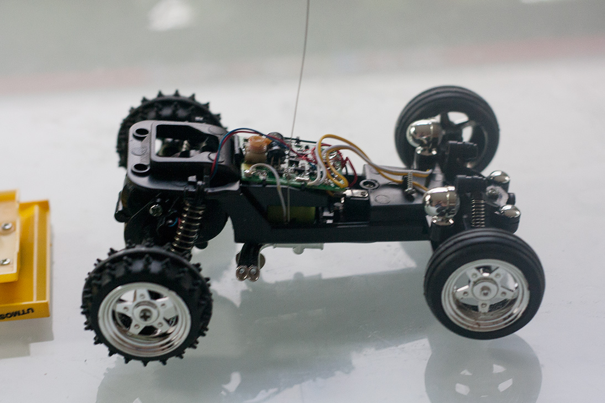
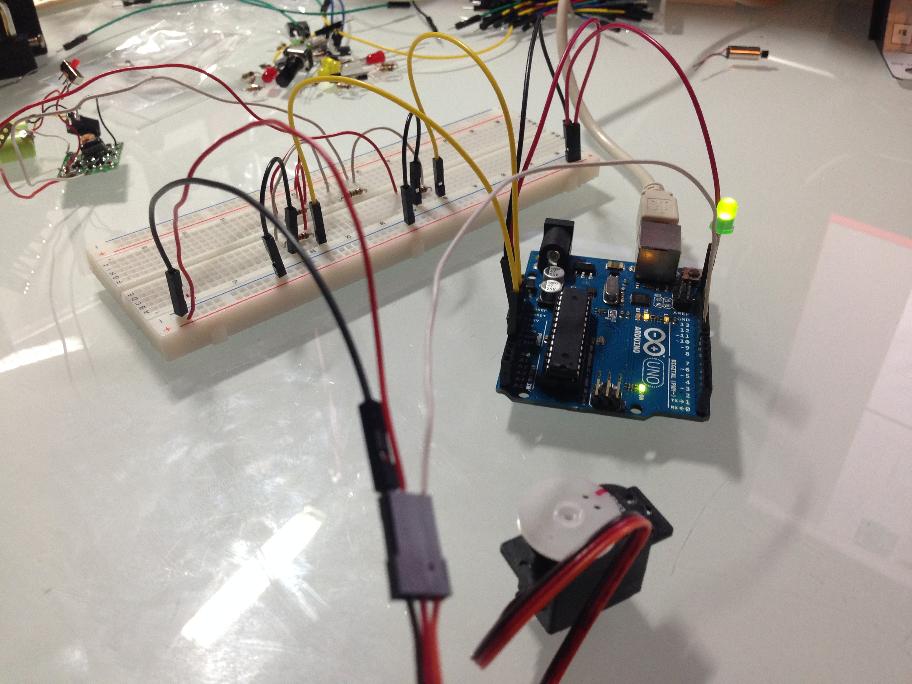
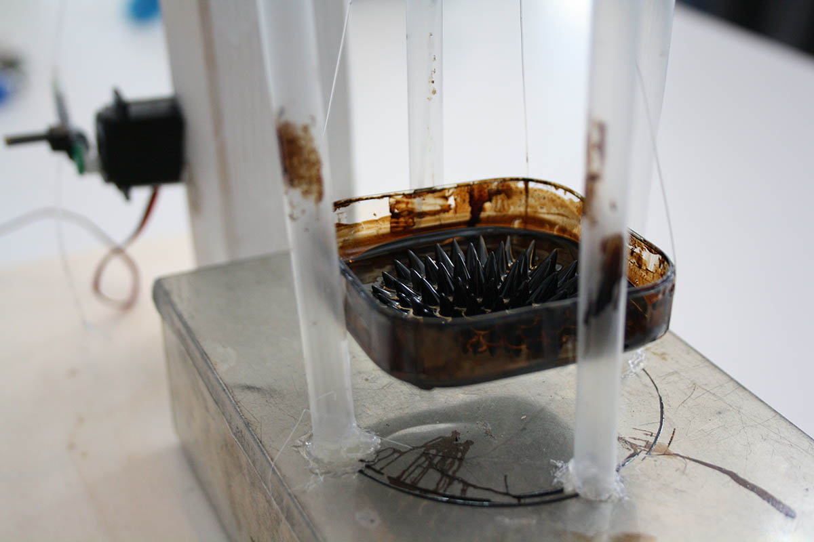

# LiquidTraffic (RCC Hack)
----------------------------------
This arduino sketch was written to create a mechatronical data visualization. Therefore it reads signals from an remote controlled car and handles an servomotor.

If the arduino receives forward signals, it moves the servomotor so that the ferroliquid is stronger influenced by the magnetic field, if it receives backward signals it reduces the influence.

## Setup

## Mechatronical data visualization with ferroliquid

## Info

This student research project was created in context of the course [Eingabe, Ausgabe. Grundlagen der prozessorientierten Gestaltung](https://incom.org/workspace/5122) at [University of Applied Sciences Potsdam](http://design.fh-potsdam.de).

----------------------------------
Copyright © 2014 Felix Leupold (xiel)

This work is free. You can redistribute it and/or modify it under the
terms of the Do What The Fuck You Want To Public License, Version 2,
as published by Sam Hocevar. See http://www.wtfpl.net/ for more details.

